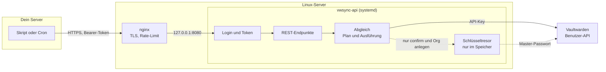
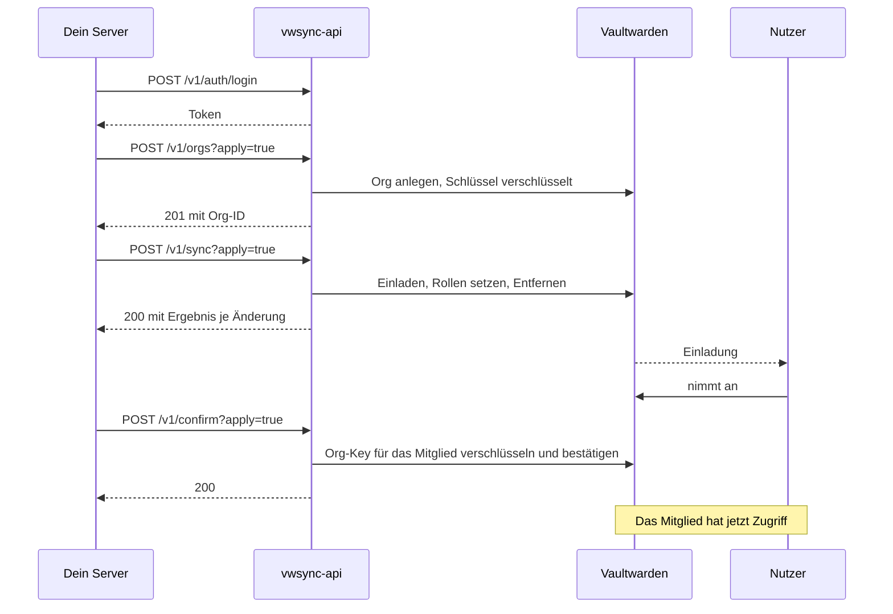
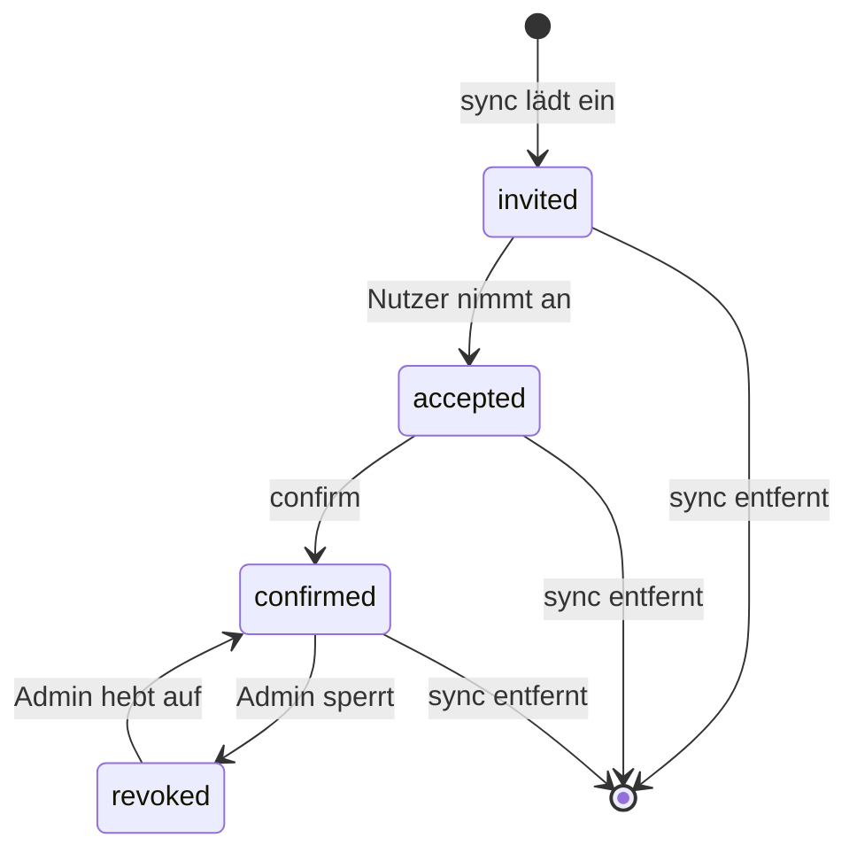
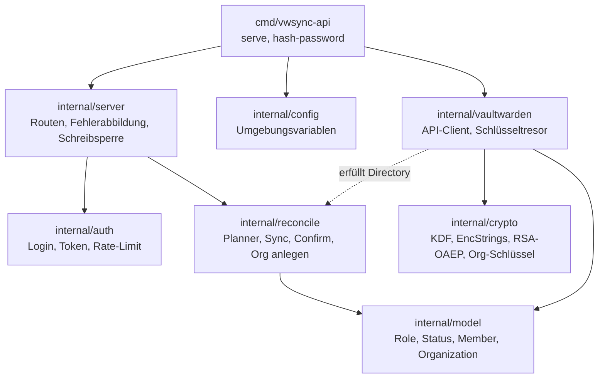

# vwsync-api

REST-Service in Go, der Organisationen, Mitglieder und Rollen eines Vaultwarden-Servers mit einem Soll-Zustand abgleicht. Ein anderer Server ruft ihn per HTTPS auf, nach Login mit Benutzername und Passwort.

Der Service schreibt **nicht** direkt in die Datenbank. Er spricht mit der Vaultwarden-API über einen persönlichen API-Key. Nur so bleiben Einladungs-Mails, Plausibilitätsprüfungen und die Ende-zu-Ende-Verschlüsselung beim Bestätigen intakt.

| Dokument | Inhalt |
|---|---|
| [SETUP.md](SETUP.md) | Installation auf einem Linux-Server mit systemd und nginx, Betrieb, Fehlersuche |
| [docs/API.md](docs/API.md) | Alle Endpunkte mit Parametern, Beispielen, Antworten und Statuscodes |
| [.env.example](.env.example) | Konfigurationsvorlage |

## Überblick



## Was der Service kann

| Endpunkt | Zweck |
|---|---|
| `POST /v1/auth/login` | Anmelden, liefert ein Token |
| `GET /v1/orgs` | Verwaltbare Organisationen auflisten |
| `POST /v1/orgs` | Organisation anlegen |
| `GET /v1/orgs/{org}/members` | Mitglieder mit Rolle und Status |
| `GET /v1/export` | Ist-Zustand aller Orgs, als Vorlage für den Sync |
| `POST /v1/sync` | Einladen, Rollen ändern, Entfernen nach Soll-Zustand |
| `POST /v1/confirm` | Mitglieder bestätigen, die ihre Einladung angenommen haben |

Rollen: `owner`, `admin`, `manager`, `custom` ("Alle Sammlungen verwalten") und `user`. Details in [docs/API.md](docs/API.md).

## Ablauf: von der neuen Org zum bestätigten Mitglied



Ein Mitglied durchläuft diese Zustände. Der Service setzt die Übergänge `sync` und `confirm`, den Rest machen der Nutzer oder ein Admin in Vaultwarden:



## Sicherheitsnetze

- **Dry-Run ist Standard.** Alle schreibenden Endpunkte ändern erst mit `apply=true` etwas.
- **Löschbremse.** Mehr als `max_removals` (Standard 5) geplante Entfernungen brechen vor jeder Änderung ab. `no_remove=true` verbietet Entfernen ganz.
- **Das API-Konto wird nie geändert oder entfernt.** Gesperrte Mitglieder auch nicht: Sie werden nie entfernt, auch nicht bei einer leeren Soll-Liste, und der Export lässt sich gefahrlos zurückschicken.
- **Kein stilles Löschen durch Tippfehler.** Unbekannte JSON-Felder werden abgelehnt.
- **Confirm mit Allowlist.** Der Aufruf muss die E-Mail-Adressen nennen oder ausdrücklich `all=true` setzen, weil beim Bestätigen dem Public Key vertraut wird, den der Server liefert.
- **Keine doppelten Orgs.** Vaultwarden erzwingt keine eindeutigen Namen. Der Service prüft vorher.
- **Ein Schreiblauf zugleich.** Ein zweiter bekommt `409`. Ein abgebrochener Aufruf lässt keinen halb ausgeführten Lauf zurück.
- **Teilfehler stoppen den Lauf nicht.** Antwort `207` mit `failures`. Ein erneuter Aufruf holt den Rest nach, weil die Planung idempotent ist.
- Rollenwechsel behalten bestehende Collection-Zugriffe.

## Sicherheit des Dienstes

- **Login:** ein Benutzer aus der Umgebung, Passwort als bcrypt-Hash. Der Hash wird auch bei falschem Benutzernamen berechnet, damit die Antwortzeit nichts verrät.
- **Token:** HS256-JWT, standardmäßig 15 Minuten gültig. Es gibt keine Sperrliste. Wer alle Tokens sofort entwerten will, ändert `VWSYNC_JWT_SECRET` und startet neu.
- **Rate-Limit:** 5 fehlgeschlagene Logins pro Minute und Client im Dienst, dazu nginx. IPv6-Clients zählen je /64-Netz, der Speicher des Limiters ist begrenzt. `X-Real-IP` wird nur von Loopback geglaubt.
- **Master-Passwort:** nur für `confirm` und `POST /v1/orgs`. Der entsperrte Schlüssel bleibt im Arbeitsspeicher, solange der Prozess läuft. Ohne `VW_MASTER_PASSWORD` sind diese beiden Funktionen aus.
- **Logs:** nie Header, Bodies, Tokens oder Passwörter. Jede ausgeführte Änderung steht als `audit`-Zeile im Log, Panics mit Stacktrace. Level und Format (`json`) sind einstellbar.
- **Rechte:** Der Dienst kann alles, was das API-Konto in den Orgs darf. Nimm ein eigenes Konto dafür.
- **systemd-Härtung:** eigener Benutzer, schreibgeschütztes Dateisystem, keine Capabilities, eingeschränkte Systemaufrufe.

## Getestet gegen

| Vaultwarden | Unit-Tests | End-to-End |
|---|---|---|
| 1.35.4 | ja | ja |
| 1.37.1 | ja | ja |
| 1.37.3 | ja | ja |

Der End-to-End-Test startet die echte Binary gegen eine frische Vaultwarden-Instanz und prüft den ganzen Ablauf: Login, Org anlegen, Einladen, Bestätigen, Rollenwechsel, Entfernen und die Rechte der Rolle `custom`. Mit der Original-Bitwarden-CLI als unabhängigem Client wird zusätzlich geprüft, dass die erzeugten Konten und Orgs lesbar sind, auch mit Argon2id.

## Entwicklung

```bash
make test       # go vet + go test -race, ohne Netzwerk
make e2e        # End-to-End gegen ein Wegwerf-Vaultwarden
make linux      # statisches Linux-Binary in dist/, Version aus git describe (VERSION=v1.2.0 überschreibt)
```

`make e2e` braucht eine laufende Wegwerf-Instanz. Der Test registriert eigene Konten mit Zufallspasswörtern und nutzt `bw` (falls installiert) mit eigenem Datenverzeichnis, nie mit deiner Konfiguration:

```bash
docker run -d --rm --name vwsync-e2e -p 127.0.0.1:18082:80 \
  -e DOMAIN=http://127.0.0.1:18082 -e I_REALLY_WANT_VOLATILE_STORAGE=true \
  -e LOGIN_RATELIMIT_MAX_BURST=1000 -e LOGIN_RATELIMIT_SECONDS=1 \
  vaultwarden/server:latest
```

Die Pakete bauen aufeinander auf. Pfeile zeigen, wer wen nutzt:



Die Diff-Logik (`Planner`) ist eine reine Funktion ohne Netzwerk. Das macht sie vollständig per Unit-Test prüfbar.
