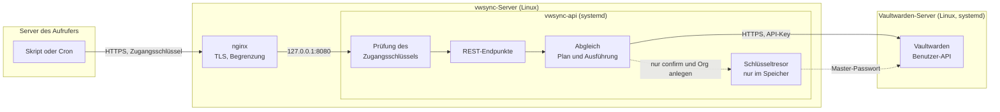
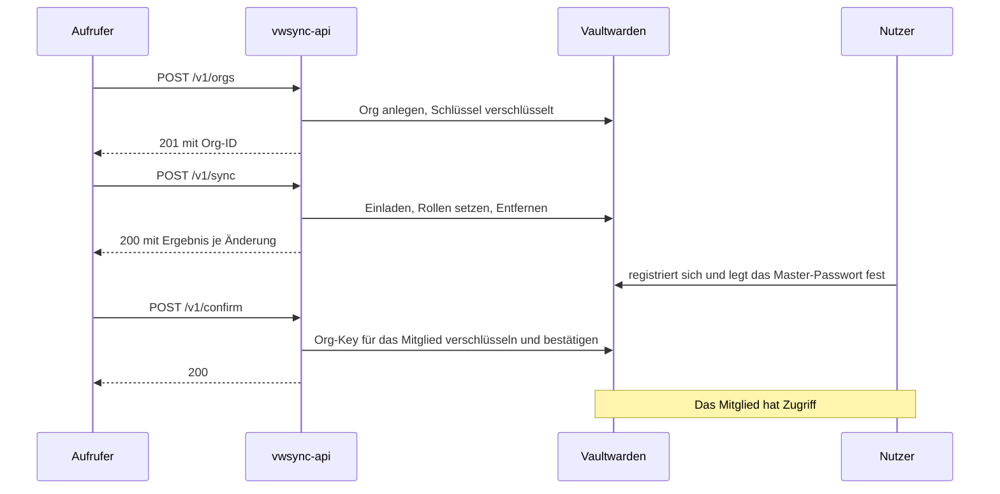
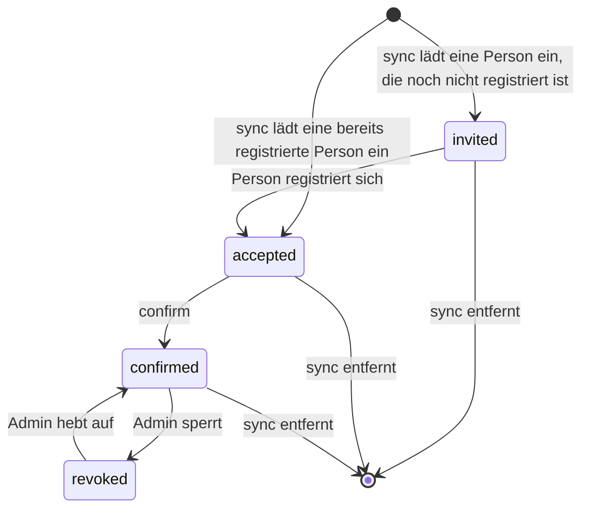
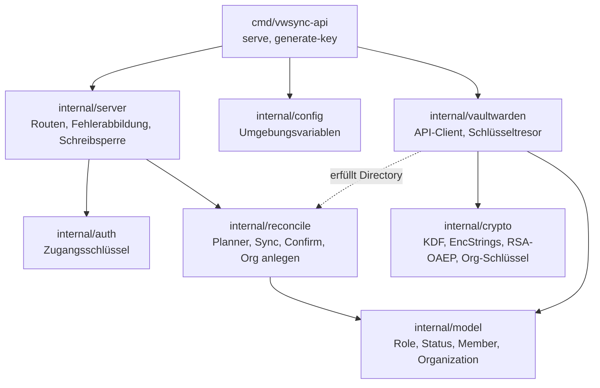

# vwsync-api

vwsync-api ist ein REST-Dienst in Go für die Verwaltung von Vaultwarden-Organisationen. Ein Aufrufer beschreibt den gewünschten Zustand aus Organisationen, Mitgliedern und Rollen, und der Dienst stellt ihn her. Er lädt ein, ändert Rollen, entfernt Mitglieder, bestätigt registrierte Mitglieder und legt Organisationen an. Der Zugriff erfolgt per HTTPS mit einem festen Zugangsschlüssel.

Der Dienst läuft auf einem eigenen Server und ruft Vaultwarden über HTTPS auf einem anderen Server auf. Er arbeitet ausschließlich über die Benutzer-API von Vaultwarden, mit dem persönlichen API-Key eines dafür vorgesehenen Kontos, und schreibt nie in die Datenbank. Die Prüfungen des Servers und die Ende-zu-Ende-Verschlüsselung beim Bestätigen bleiben dadurch erhalten. Ein Mailserver ist nicht nötig. Niemand muss eine Einladung annehmen, eine Person muss sich nur in Vaultwarden registrieren und damit ihr Master-Passwort festlegen.

| Dokument | Inhalt |
|---|---|
| [SETUP.md](SETUP.md) | Installation auf Linux mit systemd und nginx, Betrieb und Fehlersuche |
| [docs/API.md](docs/API.md) | Referenz aller Endpunkte mit Parametern, Beispielen und Statuscodes |
| [.env.example](.env.example) | Vorlage für die Konfiguration |

## Funktionen

| Endpunkt | Zweck |
|---|---|
| `GET /v1/orgs` | Verwaltbare Organisationen auflisten |
| `POST /v1/orgs` | Organisation anlegen |
| `GET /v1/orgs/{org}/members` | Mitglieder einer Organisation mit Rolle und Status |
| `GET /v1/export` | Ist-Zustand aller Organisationen, zugleich Vorlage für den Abgleich |
| `GET /healthz`, `GET /readyz` | Lebenszeichen und Bereitschaft, ohne Schlüssel |
| `POST /v1/sync` | Einladen, Rollen ändern und Entfernen nach Soll-Zustand |
| `POST /v1/confirm` | Mitglieder bestätigen, die sich registriert haben |

Unterstützte Rollen sind `owner`, `admin`, `manager`, `custom` (mit der Berechtigung "Alle Sammlungen verwalten") und `user`.

## Schnellstart

Die vollständige Anleitung steht in [SETUP.md](SETUP.md). Kurzfassung für eine Entwicklungsumgebung:

```bash
go build -o vwsync-api ./cmd/vwsync-api
./vwsync-api generate-key           # gibt den Zugangsschlüssel und die Zeile für die Konfiguration aus
cp .env.example .env                # Werte eintragen, darunter VWSYNC_API_KEY_HASH aus dem letzten Schritt.
                                    # VWSYNC_LOG_FILE leeren, dann geht das Log auf die Konsole
set -a; . ./.env; set +a            # Datei als Umgebungsvariablen laden
./vwsync-api serve
```

Anschließend ruft ein Aufrufer die Endpunkte mit dem Zugangsschlüssel auf.

```bash
KEY=vwsk_...    # Ausgabe von generate-key
curl -H "Authorization: Bearer $KEY" http://127.0.0.1:8080/v1/orgs
```

## Architektur



nginx terminiert TLS und begrenzt Anfragen. Der Dienst lauscht nur auf der lokalen Schleife. Er hält keinen Zustand auf der Platte, der Soll-Zustand liegt beim Aufrufer. Die Verbindung zu Vaultwarden muss HTTPS nutzen, der Dienst lehnt unverschlüsseltes HTTP außer für `localhost` ab.

## Ablauf

Von der neuen Organisation bis zum bestätigten Mitglied durchläuft ein Aufrufer diese Schritte. Die Person kann sich vor oder nach der Einladung in Vaultwarden registrieren.



Ein Mitglied durchläuft dabei diese Zustände. Der Dienst löst die Übergänge durch `sync` und `confirm` aus. Die Registrierung nimmt die Person selbst vor, Sperren setzt und hebt ein Admin in Vaultwarden auf. Bestätigen lässt sich nur, wer sich registriert hat, denn erst dann gibt es einen öffentlichen Schlüssel, für den der Organisations-Schlüssel verschlüsselt werden kann. Wer noch nicht registriert ist, bleibt `invited`. `confirm` meldet diese Personen als wartend, und ein späterer Aufruf bestätigt sie.



## Schutzmechanismen beim Abgleich

- **Vorschau auf Wunsch.** Die schreibenden Endpunkte führen aus, was sie erhalten. Mit `dry_run=true` zeigen sie nur, was geschehen würde, und ändern nichts. Die Antwort hat in beiden Fällen denselben Aufbau.
- **Obergrenze für Entfernungen.** Plant ein Lauf mehr als `max_removals` Entfernungen (Standard 5, gezählt über alle Organisationen), bricht er vor der ersten Änderung ab. Mit `no_remove=true` entfernt der Dienst niemanden.
- **Geschützte Konten.** Das API-Konto wird nie geändert oder entfernt. Gesperrte Mitglieder bleiben immer unangetastet, auch bei leerem Soll-Zustand. Der Export lässt sich deshalb gefahrlos zurückschicken.
- **Strikte Eingabe.** Unbekannte JSON-Felder werden abgelehnt. Ein Tippfehler im Feldnamen kann so nicht als leere Mitgliederliste gelten.
- **Bestätigung mit Auswahl.** `confirm` verlangt entweder eine Liste von E-Mail-Adressen oder ausdrücklich `all=true`, weil beim Bestätigen dem öffentlichen Schlüssel vertraut wird, den der Server liefert.
- **Nur Registrierte werden bestätigt.** Wer sich noch nicht registriert hat, bleibt unverändert und erscheint als wartend. Ein Aufruf ohne bestätigbare Mitglieder braucht kein Master-Passwort.
- **Keine doppelten Organisationen.** Vaultwarden erzwingt keine eindeutigen Namen. Der Dienst prüft den Namen vor dem Anlegen.
- **Ein Schreiblauf zugleich.** Ein zweiter Lauf erhält `409`. Ein abgebrochener Aufruf hinterlässt keinen halb ausgeführten Lauf.
- **Teilfehler.** Eine fehlgeschlagene Änderung stoppt die übrigen nicht. Die Antwort `207` nennt die Fehler. Weil der Abgleich idempotent ist, holt ein erneuter Aufruf den Rest nach.
- **Erhalt von Zugriffen.** Rollenwechsel behalten bestehende Zuordnungen zu Sammlungen.

## Betrieb als Dienst

vwsync-api läuft unter systemd als `Type=notify`-Dienst. `systemctl start` kehrt erst zurück, wenn der Dienst bereit ist. `systemctl stop` und `restart` lassen laufende Requests zu Ende laufen, ein Sync wird nicht mittendrin abgebrochen. `systemctl reload` öffnet die Logdatei neu, die mitgelieferte logrotate-Vorlage nutzt das. Ein Watchdog startet den Dienst neu, wenn er nicht mehr antwortet. Ist Vaultwarden beim Start nicht erreichbar, startet der Dienst trotzdem und meldet den Zustand über `/readyz`. Ein falscher API-Key oder eine falsche Konfiguration beenden ihn dagegen mit Code 78, ohne Neustart-Schleife. Einzelheiten stehen in [SETUP.md](SETUP.md#verhalten-unter-systemd).

## Sicherheit des Dienstes

- **Zugangsschlüssel.** Aufrufer senden einen festen Schlüssel mit 256 Bit Zufall im Header `Authorization: Bearer`. Der Dienst speichert nur dessen SHA-256-Hash und vergleicht in konstanter Zeit. Es gibt keinen Login und keine Sitzungen. Der Schlüssel läuft nicht ab. Wer ihn sperren will, entfernt seinen Hash aus der Konfiguration. Mehrere Hashes gelten gleichzeitig, damit sich ein Schlüssel ohne Unterbrechung austauschen lässt. Ein Schlüssel in der URL wird nicht akzeptiert.
- **Abgewiesene Aufrufe.** Sie erscheinen mit der Adresse des Aufrufers im Log (`request rejected`), nie mit dem Schlüssel. nginx begrenzt die Anfragen je Adresse. `X-Real-IP` gilt nur für Anfragen von der lokalen Schleife.
- **Verbindung zu Vaultwarden.** Der Dienst verlangt HTTPS für `VW_URL`, außer für `localhost`. API-Key und Schlüsselmaterial gehen so nie unverschlüsselt über das Netz. Bei einem Zertifikat einer internen CA trägt `VW_CA_FILE` die zusätzlichen Zertifizierungsstellen ein, die Prüfung bleibt aktiv.
- **Master-Passwort.** Es wird nur für `confirm` und für das Anlegen von Organisationen gebraucht. Der entsperrte Schlüssel bleibt im Arbeitsspeicher, solange der Prozess läuft. Ohne das Master-Passwort sind diese beiden Funktionen abgeschaltet, alles andere funktioniert.
- **Logs.** Der Dienst schreibt nie Header, Bodies, Schlüssel oder Passwörter ins Log. Jede ausgeführte Änderung erscheint als Zeile `audit`. Panics werden mit Stacktrace protokolliert, der Aufrufer erhält nur eine Referenz.
- **Rechte.** Der Dienst darf alles, was sein API-Konto in den Organisationen darf. Das Konto sollte ausschließlich dem Dienst dienen.
- **Härtung.** Die mitgelieferte systemd-Unit startet den Dienst unter einem eigenen Benutzer, mit schreibgeschütztem Dateisystem, ohne Capabilities und mit eingeschränkten Systemaufrufen.

## Konfiguration

Der Dienst liest seine Konfiguration aus Umgebungsvariablen. Die vollständige Liste mit Erläuterungen steht in [SETUP.md](SETUP.md#5-konfiguration-schreiben), eine Vorlage in [.env.example](.env.example).

| Variable | Pflicht | Zweck |
|---|---|---|
| `VWSYNC_API_KEY_HASH` | ja | SHA-256-Hash des Zugangsschlüssels, bei mehreren Schlüsseln kommagetrennt |
| `VW_URL`, `VW_CLIENT_ID`, `VW_CLIENT_SECRET` | ja | Vaultwarden und API-Key des Dienstkontos |
| `VW_MASTER_PASSWORD` | nein | Für `confirm` und `POST /v1/orgs` |
| `VW_CA_FILE` | nein | PEM-Datei mit zusätzlichen Zertifizierungsstellen für `VW_URL` |
| `VWSYNC_LISTEN`, `VWSYNC_TRUST_PROXY` | nein | Adresse, Vertrauen in `X-Real-IP` für die Adresse im Log |
| `VWSYNC_LOG_FILE` | nein | Logdatei, etwa `/var/log/vwsync-api/vwsync-api.log`. Ohne sie geht das Log ins Journal |
| `VWSYNC_LOG_LEVEL`, `VWSYNC_LOG_FORMAT` | nein | Log-Level und Format (`text` oder `json`) |

## Entwicklung

```bash
make test       # go vet und go test -race, ohne Netzwerk
make e2e        # End-to-End-Tests gegen eine Vaultwarden-Testinstanz
make linux      # statisches Linux-Binary in dist/
```

`make linux` übernimmt die Version aus `git describe`. Mit `make linux VERSION=v1.2.0` lässt sie sich festlegen. `vwsync-api version` gibt sie aus.

Die End-to-End-Tests starten das echte Binary und führen den gesamten Ablauf gegen eine frische Vaultwarden-Instanz aus. Sie registrieren eigene Konten mit zufälligen Passwörtern. Ist die Bitwarden-CLI (`bw`) installiert, dient sie als unabhängiger Client und liest die erzeugten Konten und Organisationen mit eigenem Datenverzeichnis. Eine Testinstanz startet so:

```bash
docker run -d --rm --name vwsync-e2e -p 127.0.0.1:18082:80 \
  -e DOMAIN=http://127.0.0.1:18082 -e I_REALLY_WANT_VOLATILE_STORAGE=true \
  -e LOGIN_RATELIMIT_MAX_BURST=1000 -e LOGIN_RATELIMIT_SECONDS=1 \
  vaultwarden/server:latest
```

Aufbau der Pakete. Pfeile zeigen, wer wen verwendet.



Die Diff-Logik im Paket `reconcile` ist eine reine Funktion ohne Netzwerkzugriff. Unit-Tests decken sie vollständig ab.
