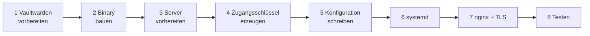
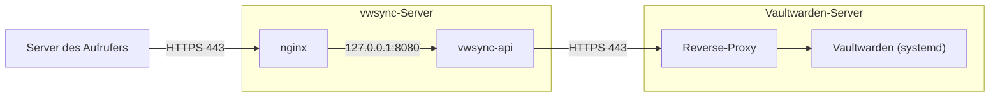

# Setup

Diese Anleitung führt von einem Linux-Server ohne Vorbereitung bis zum laufenden Dienst hinter nginx. Der Dienst läuft auf einem eigenen Server und erreicht Vaultwarden über HTTPS auf einem anderen. Sie dauert etwa 30 Minuten. Eine Einführung in den Dienst steht in der [README](README.md), die Endpunkte beschreibt die [API-Referenz](docs/API.md).

## Kurzfassung

Für alle, die den Ablauf kennen. Jeder Befehl ist in den Schritten darunter erklärt.

```bash
# Auf dem Rechner mit Go, im Projektverzeichnis
make linux
scp dist/vwsync-api deploy/vwsync-api.service deploy/nginx.conf admin@vwsync-server:

# Auf dem vwsync-Server, im Home-Verzeichnis
sudo useradd --system --no-create-home --shell /usr/sbin/nologin vwsync
sudo install -d /opt/vwsync-api /etc/vwsync-api
sudo install -m 0755 vwsync-api /opt/vwsync-api/vwsync-api
/opt/vwsync-api/vwsync-api generate-key       # Schlüssel an den Aufrufer, Hash-Zeile in die env-Datei
sudoedit /etc/vwsync-api/env                   # Inhalt nach Schritt 5
sudo chown root:vwsync /etc/vwsync-api/env && sudo chmod 0640 /etc/vwsync-api/env
sudo install -m 0644 vwsync-api.service /etc/systemd/system/
sudo systemctl daemon-reload && sudo systemctl enable --now vwsync-api
curl -s http://127.0.0.1:8080/healthz          # {"status":"ok"}
# Danach nginx und TLS einrichten (Schritt 7)
```



## Topologie



Zwei Verbindungen müssen offen sein. Der Aufrufer muss den vwsync-Server auf Port 443 erreichen. Der vwsync-Server muss den Vaultwarden-Server auf dessen HTTPS-Port erreichen, mehr ausgehenden Verkehr braucht der Dienst nicht. Der Dienst selbst lauscht auf dem vwsync-Server nur lokal.

## Voraussetzungen

| Voraussetzung | Zweck |
|---|---|
| Eigener Linux-Server mit systemd und nginx | Hier läuft der Dienst. Er lauscht nur auf `127.0.0.1`, nginx ist der einzige Zugang |
| Domain mit DNS-Eintrag und TLS-Zertifikat | nginx terminiert HTTPS. Ohne TLS gehen Zugangsdaten im Klartext über die Leitung |
| Vaultwarden auf einem anderen Server, per HTTPS erreichbar | Der Dienst nutzt dessen Benutzer-API über das Netz. Die Pfade `/identity` und `/api` müssen vom vwsync-Server aus erreichbar sein |
| Go ab Version 1.26 | Nur zum Bauen, auf einem beliebigen Rechner. Der Server braucht kein Go |
| Ein eigenes Vaultwarden-Konto für den Dienst | Siehe Schritt 1 |

## 1. Vaultwarden vorbereiten

**Dienstkonto anlegen.** Der Dienst darf alles, was sein Konto in den Organisationen darf. Ein eigenes Konto, etwa `vwsync@example.com`, lässt sich getrennt prüfen und bei Bedarf sperren. Ein persönliches Konto eignet sich nicht.

**Rechte vergeben.** Das Konto muss in jeder Organisation, die der Dienst verwaltet, Owner sein. Admin genügt zum Einladen, Entfernen und Bestätigen normaler Mitglieder. Die Rollen `owner`, `admin`, `manager` und `custom` darf in Vaultwarden jedoch nur ein Owner vergeben. Organisationen, die der Dienst selbst anlegt, gehören dem Konto automatisch.

**API-Key abrufen.** Im Web-Vault als Dienstkonto anmelden und unter *Kontoeinstellungen, Sicherheit, Schlüssel* den API-Schlüssel anzeigen. Notiere `client_id` (Format `user.<uuid>`) und `client_secret`.

**Registrierung statt Einladung.** Der Dienst ist für Vaultwarden ohne Mailversand ausgelegt, und niemand muss eine Einladung annehmen. Eine Person muss sich nur in Vaultwarden registrieren und legt dabei ihr Master-Passwort fest. Das kann vor oder nach der Einladung geschehen.

- Hat sich die Person schon registriert, setzt die Einladung sie sofort auf `accepted`, und sie lässt sich bestätigen.
- Hat sie sich noch nicht registriert, bleibt sie `invited`. Mit ihrer Registrierung wird sie von selbst `accepted`, und der nächste `confirm`-Aufruf bestätigt sie. Vorher lässt sie sich nicht bestätigen, weil es noch keinen öffentlichen Schlüssel für sie gibt.

Damit das funktioniert, muss `INVITATIONS_ALLOWED` in Vaultwarden aktiv sein (der Standard). Eine eingeladene Person darf sich auch dann registrieren, wenn die allgemeine Registrierung (`SIGNUPS_ALLOWED`) abgeschaltet ist. Ist `SIGNUPS_DOMAINS_WHITELIST` gesetzt, müssen die Adressen der Eingeladenen zu einer der Domains passen. Der Dienst benachrichtigt niemanden, die Personen müssen Adresse und Server kennen.

**Master-Passwort bereithalten.** Der Dienst braucht es nur für `POST /v1/confirm` und `POST /v1/orgs`. Ohne Master-Passwort laufen alle anderen Endpunkte, diese beiden antworten mit `503`. PBKDF2-SHA256 und Argon2id werden als Schlüsselableitung unterstützt. Eine Zwei-Faktor-Anmeldung des Kontos stört nicht, denn der Login mit API-Key umgeht sie.

**Servereinstellungen prüfen.** Setzt die Vaultwarden-Instanz `ORG_CREATION_USERS`, muss das Dienstkonto dort stehen, sonst scheitert `POST /v1/orgs` mit `502`. Dasselbe gilt, wenn das Konto Mitglied einer Organisation mit der Richtlinie "Single organization" ist. Läuft Vaultwarden als systemd-Dienst, stehen die Einstellungen als Umgebungsvariablen in der `EnvironmentFile` der Unit, deren Pfad von der Installation abhängt. Nach einer Änderung braucht Vaultwarden einen Neustart, etwa mit `systemctl restart vaultwarden`.

**Zugriff für den Dienst freigeben.** Steht vor Vaultwarden ein Reverse-Proxy oder eine Firewall mit Adresslisten, muss die Adresse des vwsync-Servers die Pfade `/identity/connect/token` und `/api/` erreichen dürfen. Die Adresse taucht dort als Quelle auf, und Vaultwarden begrenzt Logins je Adresse. Der Dienst meldet sich nur etwa alle zwei Stunden neu an.

## 2. Binary bauen

Auf einem Rechner mit Go, im Projektverzeichnis:

```bash
make linux          # erzeugt dist/vwsync-api, statisch gelinkt und ohne Abhängigkeiten
```

Ohne `make`, etwa in PowerShell:

```powershell
$env:CGO_ENABLED = "0"; $env:GOOS = "linux"; $env:GOARCH = "amd64"
go build -trimpath -ldflags="-s -w" -o dist/vwsync-api ./cmd/vwsync-api
```

Für einen ARM-Server gilt `GOARCH=arm64`.

Kopiere das Binary und die beiden Vorlagen aus `deploy/` auf den vwsync-Server, zum Beispiel ins Home-Verzeichnis. Die folgenden Schritte laufen dort.

```bash
scp dist/vwsync-api deploy/vwsync-api.service deploy/nginx.conf admin@vwsync-server:
```

## 3. Server vorbereiten

```bash
sudo useradd --system --no-create-home --shell /usr/sbin/nologin vwsync
sudo install -d /opt/vwsync-api /etc/vwsync-api
sudo install -m 0755 vwsync-api /opt/vwsync-api/vwsync-api
```

## 4. Zugangsschlüssel erzeugen

Aufrufer weisen sich mit einem festen Zugangsschlüssel aus und senden ihn mit jedem Request im Header `Authorization: Bearer <Schlüssel>`. Es gibt keinen Login und kein Ablaufdatum. Der Schlüssel besteht aus 256 Bit Zufall. Der Server speichert nur seinen SHA-256-Hash.

```bash
/opt/vwsync-api/vwsync-api generate-key
```

Der Befehl gibt zwei Dinge aus. Das erste ist der Schlüssel, er beginnt mit `vwsk_`. Das zweite ist die Zeile `VWSYNC_API_KEY_HASH=...` mit 64 Hex-Zeichen für die Konfiguration in Schritt 5.

Sichere den Schlüssel sofort im Secret-Store des Aufrufers. Der Dienst speichert ihn nicht und kann ihn nicht erneut anzeigen. Geht er verloren, erzeugst du mit `generate-key` einen neuen und tauschst den Hash aus.

Der Zugangsschlüssel ist nicht der API-Key des Vaultwarden-Dienstkontos aus Schritt 1. Er gehört dem Aufrufer und öffnet diesen Dienst. Der Vaultwarden-API-Key gehört dem Dienst und öffnet Vaultwarden.

## 5. Konfiguration schreiben

Lege `/etc/vwsync-api/env` an. Eine Vorlage liegt in [.env.example](.env.example).

```bash
VWSYNC_LISTEN=127.0.0.1:8080
VWSYNC_API_KEY_HASH=...
VWSYNC_TRUST_PROXY=true

VW_URL=https://vault.example.com
VW_CLIENT_ID=user.00000000-0000-0000-0000-000000000000
VW_CLIENT_SECRET=...
VW_MASTER_PASSWORD=...
#VW_CA_FILE=/etc/vwsync-api/vaultwarden-ca.pem
```

| Variable | Pflicht | Beschreibung |
|---|---|---|
| `VWSYNC_LISTEN` | nein | Adresse und Port. Standard ist `127.0.0.1:8080`. Nicht auf `0.0.0.0` setzen |
| `VWSYNC_API_KEY_HASH` | ja | SHA-256-Hash des Zugangsschlüssels aus Schritt 4, 64 Hex-Zeichen. Mehrere Hashes durch Kommas getrennt gelten gleichzeitig, das erleichtert den Austausch eines Schlüssels |
| `VWSYNC_TRUST_PROXY` | nein | `true`, wenn nginx den Header `X-Real-IP` setzt. Der Dienst glaubt den Header nur bei Anfragen von `127.0.0.1` oder `::1`, nginx muss also auf demselben Server laufen. Ohne diese Einstellung steht bei abgewiesenen Aufrufen die Adresse von nginx im Log statt die des Aufrufers |
| `VWSYNC_LOG_LEVEL` | nein | `debug`, `info` (Standard), `warn` oder `error`. Mit `debug` protokolliert der Dienst jeden Aufruf an Vaultwarden mit Methode, Pfad, Status und Dauer, nie mit Bodies oder Schlüsseln |
| `VWSYNC_LOG_FORMAT` | nein | `text` (Standard) oder `json`, etwa für Loki oder ELK |
| `VW_URL` | ja | Adresse von Vaultwarden ohne abschließenden Schrägstrich. Sie muss mit `https://` beginnen. Unverschlüsseltes `http://` akzeptiert der Dienst nur für `localhost`, weil API-Key und Schlüsselmaterial über diese Verbindung gehen |
| `VW_CA_FILE` | nein | PEM-Datei mit zusätzlichen Zertifizierungsstellen, wenn das Zertifikat von Vaultwarden von einer internen CA stammt. Die Prüfung des Zertifikats bleibt aktiv, die Datei erweitert nur die vertrauenswürdigen Aussteller |
| `VW_CLIENT_ID`, `VW_CLIENT_SECRET` | ja | API-Key aus Schritt 1 |
| `VW_MASTER_PASSWORD` | nein | Nur für `confirm` und das Anlegen von Organisationen. Enthält es Sonderzeichen, gehört es in einfache Anführungszeichen |

Stammt das Zertifikat von Vaultwarden von einer internen CA, lege deren Zertifikat auf dem vwsync-Server ab, etwa als `/etc/vwsync-api/vaultwarden-ca.pem`, und setze `VW_CA_FILE`. Die Datei muss für den Benutzer `vwsync` lesbar sein.

Die `env`-Datei enthält API-Key und Master-Passwort und braucht strenge Rechte:

```bash
sudo chown root:vwsync /etc/vwsync-api/env
sudo chmod 0640 /etc/vwsync-api/env
```

## 6. Dienst starten

```bash
sudo install -m 0644 vwsync-api.service /etc/systemd/system/
sudo systemctl daemon-reload
sudo systemctl enable --now vwsync-api
sudo systemctl status vwsync-api
curl -s http://127.0.0.1:8080/healthz
# {"status":"ok"}
```

`journalctl -u vwsync-api -f` zeigt das Log. Beim Start meldet sich der Dienst einmal bei Vaultwarden an und schreibt eine Zeile wie `msg=listening addr=127.0.0.1:8080 version=v1.0.0 confirm_enabled=true`. Falsche API-Key-Daten oder eine falsche `VW_URL` brechen den Start mit einer klaren Meldung ab. Fehlende Variablen meldet der Dienst gesammelt.

Die Unit startet den Dienst als eigenen Benutzer ohne Schreibrechte im Dateisystem, ohne zusätzliche Capabilities und mit eingeschränkten Systemaufrufen.

`TimeoutStopSec=900` ist beabsichtigt. Ein `stop` oder `restart` wartet auf einen laufenden Sync oder Confirm, bis zu 15 Minuten, statt ihn nach den üblichen 90 Sekunden abzubrechen. Der Dienst nimmt in dieser Zeit keine neuen Anfragen an. Wer die Wartezeit verkürzen möchte, ändert den Wert in der Unit. Ein erneuter Aufruf holt Unterbrochenes nach.

## 7. nginx und TLS

Zertifikat besorgen, zum Beispiel mit certbot:

```bash
sudo certbot certonly --nginx -d vwsync.example.com
```

Installiere die übertragene Vorlage [nginx.conf](deploy/nginx.conf) und passe darin `server_name` sowie die Zertifikatspfade an. Sie bindet eine Proxy-Datei ein, die du einmal anlegst. Ihr Inhalt steht auch als Kommentar am Ende der Vorlage.

```bash
sudo install -m 0644 nginx.conf /etc/nginx/sites-available/vwsync
sudoedit /etc/nginx/sites-available/vwsync      # server_name und Zertifikatspfade anpassen
sudo tee /etc/nginx/vwsync-proxy.inc >/dev/null <<'EOF'
proxy_pass         http://127.0.0.1:8080;
proxy_set_header   Host $host;
proxy_set_header   X-Real-IP $remote_addr;
proxy_read_timeout 600s;
proxy_send_timeout 600s;
EOF
sudo ln -s /etc/nginx/sites-available/vwsync /etc/nginx/sites-enabled/
sudo nginx -t && sudo systemctl reload nginx
```

Die langen Timeouts brauchen große Abgleiche und Bestätigungen. Die Konfiguration begrenzt außerdem die Anfragen je Adresse auf 60 pro Minute mit kurzen Spitzen von bis zu 30 weiteren. Der Dienst selbst begrenzt nicht, bei 256 Bit Zufall im Schlüssel lässt sich ein Schlüssel nicht erraten.

Kennt die Distribution kein `sites-available`, etwa RHEL, gehört die Datei nach `/etc/nginx/conf.d/vwsync.conf`, und der Link entfällt.

Ist der Dienst nur über ein internes Netz oder per VPN erreichbar, darf `server_name` ein interner Name sein. TLS bleibt in jedem Fall erforderlich.

## 8. Testen

```bash
BASE=https://vwsync.example.com
KEY=vwsk_...    # Schlüssel aus Schritt 4

curl $BASE/healthz
# {"status":"ok"}

curl -H "Authorization: Bearer $KEY" $BASE/v1/orgs
# {"orgs":[...]}
```

Als Nächstes lohnt sich ein Lauf ohne Wirkung. `GET /v1/export` liefert im Feld `desired` den aktuellen Zustand im Format des Abgleichs. Schickt man ihn mit `dry_run=true` an `POST /v1/sync`, ergibt das einen Plan ohne Änderungen und zeigt, dass Lesen, Planen und Zugriffsrechte funktionieren. Ohne `dry_run=true` würde der Dienst den Plan ausführen, hier wäre er leer:

```bash
curl -s -H "Authorization: Bearer $KEY" $BASE/v1/export | jq .desired > ist.json
curl -s -X POST "$BASE/v1/sync?dry_run=true" -H "Authorization: Bearer $KEY" -d @ist.json | jq .
```

Weil schreibende Aufrufe sofort ausgeführt werden, sollte jede neue Soll-Datei zuerst mit `dry_run=true` laufen. Beim ersten echten Lauf empfiehlt sich eine Testorganisation. Lege sie mit `POST /v1/orgs` an und lade einen Testnutzer ein. So zeigt sich früh, ob Richtlinien oder Servereinstellungen etwas ablehnen, bevor echte Organisationen betroffen sind.

## Betrieb

### Logs

`journalctl -u vwsync-api` zeigt das Log. Der Dienst schreibt je Anfrage Methode, Pfad, Query, Status und Dauer. Die Query verrät, ob `dry_run=true` gesetzt war und der Aufruf nur eine Vorschau lieferte. Dazu kommen abgewiesene Aufrufe mit der Adresse des Aufrufers (`request rejected`) und für jede ausgeführte Änderung eine Zeile `audit`.

```
level=INFO msg=audit org="Team Alpha" type=invite email=carol@example.com ok=true role=user
level=INFO msg=audit org="Team Alpha" type=remove email=dave@example.com ok=true
level=INFO msg=audit org="Team Alpha" type=confirm email=alice@example.com ok=true
```

`journalctl -u vwsync-api | grep audit` listet alle Änderungen. Header, Bodies, Schlüssel und Passwörter stehen nie im Log. Bei einem Absturz steht der Stacktrace im Log, der Aufrufer erhält nur eine Referenz wie `internal error (ref 1a2b3c4d)`.

### Version

`/opt/vwsync-api/vwsync-api version` nennt den laufenden Stand. Er steht auch beim Start im Log (`version=...`). Beim Bauen legt `make linux VERSION=v1.2.0` die Version fest. Ohne Angabe kommt sie aus `git describe`.

### Aktualisieren

```bash
# Neues Binary bauen und übertragen (Schritt 2), dann auf dem Server:
sudo install -m 0755 vwsync-api /opt/vwsync-api/vwsync-api
sudo systemctl restart vwsync-api
```

Der Dienst hält keinen Zustand auf der Platte. Zu sichern ist nur `/etc/vwsync-api/env`.

### Zugangsdaten wechseln

| Was | Vorgehen |
|---|---|
| Zugangsschlüssel ohne Unterbrechung austauschen | Mit `generate-key` einen neuen Schlüssel erzeugen und seinen Hash zusätzlich in `VWSYNC_API_KEY_HASH` eintragen, kommagetrennt. Dienst neu starten, den Aufrufer auf den neuen Schlüssel umstellen, danach den alten Hash entfernen und neu starten |
| Zugangsschlüssel sofort sperren | Seinen Hash aus `VWSYNC_API_KEY_HASH` entfernen und den Dienst neu starten. Ein Schlüssel hat kein Ablaufdatum und gilt bis dahin |
| API-Key von Vaultwarden | Schlüssel im Web-Vault rotieren, `VW_CLIENT_SECRET` ersetzen, Dienst neu starten |
| Master-Passwort geändert | `VW_MASTER_PASSWORD` ersetzen, Dienst neu starten |

### Checkliste

- [ ] Der Dienst lauscht nur auf `127.0.0.1`. nginx läuft auf demselben Server und ist der einzige Zugang.
- [ ] HTTPS mit gültigem Zertifikat.
- [ ] `/etc/vwsync-api/env` gehört `root:vwsync` und hat die Rechte `0640`.
- [ ] Der Dienst nutzt ein eigenes Vaultwarden-Konto.
- [ ] Der Zugangsschlüssel liegt nur beim Aufrufer, in einer Datei mit Rechten `0600` oder einem Secret-Store, nicht in Crontab, Repository oder Log.
- [ ] Der Zugangsschlüssel wird nie in einer URL übergeben, nur im Header `Authorization`.
- [ ] Der Aufrufer wertet bei `207` das Feld `failures` aus.

## Fehlersuche

| Symptom | Ursache | Abhilfe |
|---|---|---|
| Start bricht ab mit `invalid configuration: ... is missing` | Eine Variable fehlt oder ist leer | Die Meldung nennt alle fehlenden Variablen. `env`-Datei prüfen |
| Start bricht ab mit `VWSYNC_API_KEY_HASH is missing` | Die Variable fehlt oder ist leer | Mit `vwsync-api generate-key` Schlüssel und Hash erzeugen und die Zeile `VWSYNC_API_KEY_HASH=...` eintragen |
| Start bricht ab mit `VWSYNC_API_KEY_HASH: ... is not a SHA-256 hash` | Der Hash ist abgeschnitten, oder statt des Hashes steht der Schlüssel selbst | Die Hash-Zeile aus `generate-key` verwenden, sie hat 64 Hex-Zeichen. Der Schlüssel beginnt mit `vwsk_` und gehört nur zum Aufrufer |
| Start bricht ab mit `vaultwarden login: ... invalid_client` | `VW_CLIENT_ID` oder `VW_CLIENT_SECRET` ist falsch | API-Key im Web-Vault erneut ansehen. Die `client_id` beginnt mit `user.` |
| Start bricht ab mit `vaultwarden login: ... connection refused` oder Zeitüberschreitung | `VW_URL` ist falsch, oder der Vaultwarden-Server ist vom vwsync-Server aus nicht erreichbar | Vom vwsync-Server aus `curl $VW_URL/alive` prüfen. Firewall und Reverse-Proxy von Vaultwarden kontrollieren |
| Start bricht ab mit `certificate signed by unknown authority` | Das Zertifikat von Vaultwarden stammt von einer CA, die der vwsync-Server nicht kennt | Das CA-Zertifikat als PEM ablegen und `VW_CA_FILE` setzen |
| Start bricht ab mit `VW_URL must use https` | `VW_URL` beginnt mit `http://` und zeigt nicht auf `localhost` | HTTPS am Vaultwarden-Reverse-Proxy einrichten und die URL anpassen |
| `401` bei jedem Aufruf | Der Schlüssel fehlt oder ist falsch, oder der Header hat nicht die Form `Authorization: Bearer <Schlüssel>` | Im Log steht `request rejected` mit der Adresse des Aufrufers. Ob der Schlüssel zur Konfiguration passt, zeigt `printf %s "$KEY" \| sha256sum`. Das Ergebnis muss einem Eintrag in `VWSYNC_API_KEY_HASH` entsprechen |
| `404` bei `/v1/sync` | Der Organisationsname stimmt nicht, oder das Konto ist dort weder Owner noch Admin | `GET /v1/orgs` zeigt, welche Organisationen der Dienst sieht. Die Groß- und Kleinschreibung spielt keine Rolle |
| `422` mit `matches several organizations` | Zwei Organisationen unterscheiden sich nur in der Schreibweise ihres Namens | Statt des Namens die ID verwenden, sie steht in der Meldung |
| `409` bei einem schreibenden Aufruf | Ein anderer Schreiblauf läuft | Kurz warten und erneut senden |
| `400` mit `the apply parameter does not exist` | Ein Aufrufer sendet `apply=true` oder `apply=false` | Den Parameter entfernen. Schreibende Aufrufe laufen direkt, `dry_run=true` zeigt nur eine Vorschau |
| Ein Mitglied erscheint in `confirm` unter `waiting` und wird nicht bestätigt | Die Person hat sich noch nicht registriert | Sie muss sich in Vaultwarden mit genau dieser Adresse registrieren. Danach bestätigt der nächste Aufruf sie |
| `502` mit `User does not exist` beim Einladen | Vaultwarden erlaubt keine Einladungen für unregistrierte Personen | `INVITATIONS_ALLOWED` in Vaultwarden aktivieren, oder die Person zuerst registrieren lassen |
| `502` mit `Email domain not eligible for invitations` | Die Domain steht nicht in `SIGNUPS_DOMAINS_WHITELIST` | Die Domain in Vaultwarden aufnehmen |
| `422` mit Hinweis auf `max_removals` | Der Lauf plant mehr Entfernungen als erlaubt | Soll-Zustand prüfen. Ist er richtig, `max_removals` erhöhen |
| `500` mit `MAC mismatch (wrong master password?)` | `VW_MASTER_PASSWORD` ist falsch | Passwort korrigieren und den Dienst neu starten |
| `503` bei `confirm` oder `POST /v1/orgs` | `VW_MASTER_PASSWORD` ist nicht gesetzt | Variable in der `env`-Datei ergänzen und den Dienst neu starten |
| `502` mit einer Meldung von Vaultwarden | Vaultwarden lehnt den Aufruf ab | Meldung lesen. Häufige Gründe sind fehlende Owner-Rechte für `admin` oder `custom`, `ORG_CREATION_USERS` und die Richtlinie "Single organization" |
| nginx meldet `504` bei großen Läufen | Das Timeout ist zu kurz | `proxy_read_timeout` in der Proxy-Datei erhöhen |
| nginx meldet `413` | Der Body ist größer als 1 MB | `client_max_body_size` in der Konfiguration erhöhen |
