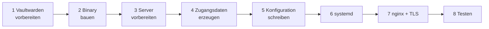

# Setup

Schritt für Schritt vom leeren Linux-Server bis zum laufenden Dienst. Dauer: etwa 30 Minuten.



## Voraussetzungen

| Was | Wofür |
|---|---|
| Linux-Server mit systemd und nginx | läuft der Dienst. Er lauscht nur auf `127.0.0.1` |
| Eine Domain mit DNS-Eintrag und TLS-Zertifikat | nginx terminiert HTTPS. Ohne TLS gehen Zugangsdaten im Klartext über die Leitung |
| Vaultwarden, erreichbar vom Server | getestet mit 1.35.4, 1.37.1 und 1.37.3 |
| Go 1.26 auf irgendeinem Rechner | nur zum Bauen. Der Server braucht kein Go |
| Ein Vaultwarden-Konto für den Dienst | siehe Schritt 1 |

## 1. Vaultwarden vorbereiten

**Eigenes Konto für den Dienst anlegen.** Der Dienst kann alles, was dieses Konto in den Orgs darf. Ein eigenes Konto (zum Beispiel `vwsync@example.com`) lässt sich getrennt prüfen und bei Bedarf sperren. Nimm kein persönliches Konto.

**Rechte.** Das Konto muss in jeder Org, die der Dienst verwalten soll, **Owner** sein. Admin reicht für Einladen, Entfernen und Bestätigen von normalen Mitgliedern. Die Rollen `owner`, `admin`, `manager` und `custom` kann Vaultwarden aber nur ein Owner vergeben. Orgs, die der Dienst selbst anlegt, gehören dem Konto automatisch.

**API-Key holen.** Im Web-Vault als dieses Konto anmelden: *Kontoeinstellungen, Sicherheit, Schlüssel, API-Schlüssel anzeigen*. Du brauchst `client_id` (Format `user.<uuid>`) und `client_secret`.

**Master-Passwort.** Der Dienst braucht es nur für `/v1/confirm` und `POST /v1/orgs`. Ohne es läuft alles andere, und diese beiden Endpunkte antworten mit `503`. Beide KDF-Varianten sind unterstützt: PBKDF2-SHA256 und Argon2id. Hat das Konto Zwei-Faktor-Anmeldung, stört das den Dienst nicht: Der Login per API-Key überspringt sie.

**Server-Einstellungen prüfen.** Setzt dein Vaultwarden `ORG_CREATION_USERS`, muss das Dienst-Konto dort erlaubt sein, sonst scheitert `POST /v1/orgs` mit `502`. Hat das Konto die Policy "Single organization" einer fremden Org, verbietet Vaultwarden ebenfalls das Anlegen.

## 2. Binary bauen

Auf einem Rechner mit Go 1.26, im Verzeichnis des Projekts:

```bash
make linux          # erzeugt dist/vwsync-api, statisch, ohne Abhängigkeiten
```

Ohne `make` (zum Beispiel unter Windows PowerShell):

```powershell
$env:CGO_ENABLED = "0"; $env:GOOS = "linux"; $env:GOARCH = "amd64"
go build -trimpath -ldflags="-s -w" -o dist/vwsync-api ./cmd/vwsync-api
```

Für einen ARM-Server `GOARCH=arm64` setzen. Kopiere `dist/vwsync-api` auf den Server, zum Beispiel mit `scp`.

## 3. Server vorbereiten

```bash
sudo useradd --system --no-create-home --shell /usr/sbin/nologin vwsync
sudo install -d /opt/vwsync-api /etc/vwsync-api
sudo install -m 0755 vwsync-api /opt/vwsync-api/vwsync-api
```

## 4. Zugangsdaten erzeugen

Der Dienst hat genau einen Benutzer. Passwort-Hash und Signatur-Secret erzeugst du einmal:

```bash
/opt/vwsync-api/vwsync-api hash-password    # fragt das Passwort ab, mindestens 12 Zeichen
openssl rand -base64 48                     # für VWSYNC_JWT_SECRET
```

`hash-password` gibt einen bcrypt-Hash aus (beginnt mit `$2a$12$`). Das Klartext-Passwort merkst du dir für den Aufrufer, es steht nirgends auf dem Server.

## 5. Konfiguration schreiben

Lege `/etc/vwsync-api/env` an, Vorlage ist [.env.example](.env.example):

```bash
VWSYNC_LISTEN=127.0.0.1:8080
VWSYNC_USER=sync
VWSYNC_PASSWORD_HASH='$2a$12$...'
VWSYNC_JWT_SECRET=...
VWSYNC_TRUST_PROXY=true

VW_URL=https://vault.example.com
VW_CLIENT_ID=user.00000000-0000-0000-0000-000000000000
VW_CLIENT_SECRET=...
VW_MASTER_PASSWORD=...
```

| Variable | Pflicht | Bedeutung |
|---|---|---|
| `VWSYNC_LISTEN` | nein | Adresse und Port, Standard `127.0.0.1:8080`. Nicht auf `0.0.0.0` stellen |
| `VWSYNC_USER` | ja | Benutzername des API-Zugangs |
| `VWSYNC_PASSWORD_HASH` | ja | bcrypt-Hash aus Schritt 4, **in einfachen Anführungszeichen** (er enthält `$`) |
| `VWSYNC_JWT_SECRET` | ja | mindestens 32 Zeichen, zufällig. Ändern entwertet alle ausgegebenen Tokens |
| `VWSYNC_TOKEN_TTL` | nein | Token-Lebensdauer, `1m` bis `24h`, Standard `15m` |
| `VWSYNC_TRUST_PROXY` | nein | `true`, wenn nginx `X-Real-IP` setzt (siehe Schritt 7). Der Header wird nur geglaubt, wenn der Request von `127.0.0.1` oder `::1` kommt, nginx muss also auf demselben Server laufen. Sonst sieht das Login-Limit nur die Adresse des Proxys |
| `VWSYNC_LOG_LEVEL` | nein | `debug`, `info` (Standard), `warn` oder `error`. Mit `debug` loggt der Dienst jeden Aufruf an Vaultwarden (Methode, Pfad, Status, Dauer, nie Bodies oder Tokens) |
| `VWSYNC_LOG_FORMAT` | nein | `text` (Standard) oder `json` für Log-Sammler wie Loki oder ELK |
| `VW_URL` | ja | Adresse deines Vaultwarden, ohne abschließenden Slash |
| `VW_CLIENT_ID`, `VW_CLIENT_SECRET` | ja | API-Key aus Schritt 1 |
| `VW_MASTER_PASSWORD` | nein | nur für `confirm` und das Anlegen von Orgs. Enthält es Sonderzeichen, in einfache Anführungszeichen setzen |

Dann absichern. Die Datei enthält API-Key und Master-Passwort:

```bash
sudo chown root:vwsync /etc/vwsync-api/env
sudo chmod 0640 /etc/vwsync-api/env
```

## 6. Dienst starten

```bash
sudo cp deploy/vwsync-api.service /etc/systemd/system/
sudo systemctl daemon-reload
sudo systemctl enable --now vwsync-api
sudo systemctl status vwsync-api
journalctl -u vwsync-api -f
```

Im Log steht beim Start `listening addr=127.0.0.1:8080 confirm_enabled=true`. Der Dienst meldet sich dabei einmal bei Vaultwarden an. Falsche API-Key-Daten oder eine falsche `VW_URL` brechen den Start mit einer klaren Meldung ab, statt erst beim ersten Request zu scheitern. Fehlende Variablen werden alle zusammen gemeldet.

Die Unit läuft als eigener Benutzer ohne Schreibrechte im Dateisystem, ohne zusätzliche Capabilities und mit eingeschränkten Systemaufrufen.

`TimeoutStopSec=900` ist Absicht: Ein `restart` oder `stop` wartet auf einen laufenden Sync oder Confirm, bis zu 15 Minuten, statt ihn nach 90 Sekunden abzuschießen. Der Dienst nimmt dabei keine neuen Requests mehr an. Wer die Wartezeit nicht will, kann sie in der Unit verkürzen, ein erneuter Lauf holt Unterbrochenes nach.

## 7. nginx und TLS

Zertifikat besorgen, zum Beispiel mit certbot:

```bash
sudo certbot certonly --nginx -d vwsync.example.com
```

Dann [deploy/nginx.conf](deploy/nginx.conf) nach `/etc/nginx/sites-available/vwsync` kopieren, `server_name` und Zertifikatspfade anpassen. Die Konfiguration verweist auf eine Proxy-Datei, die du einmal anlegst. Sie steht als Kommentar am Ende der Konfiguration:

```bash
sudo tee /etc/nginx/vwsync-proxy.inc >/dev/null <<'EOF'
proxy_pass         http://127.0.0.1:8080;
proxy_set_header   Host $host;
proxy_set_header   X-Real-IP $remote_addr;
proxy_read_timeout 600s;
proxy_send_timeout 600s;
EOF
sudo ln -s /etc/nginx/sites-available/vwsync /etc/nginx/sites-enabled/
sudo nginx -t && sudo systemctl reload nginx
```

Die langen Timeouts brauchen große Syncs und Confirms. Die Konfiguration begrenzt außerdem den Login-Endpunkt auf 10 Anfragen pro Minute und Adresse, zusätzlich zum Limit im Dienst.

Ist der Dienst nur aus einem internen Netz oder per VPN erreichbar, darf `server_name` auch ein interner Name sein. TLS bleibt trotzdem Pflicht.

## 8. Testen

```bash
BASE=https://vwsync.example.com

curl $BASE/healthz
# {"status":"ok"}

TOKEN=$(curl -s -X POST $BASE/v1/auth/login \
  -d '{"username":"sync","password":"DEIN_PASSWORT"}' | jq -r .access_token)

curl -H "Authorization: Bearer $TOKEN" $BASE/v1/orgs
# {"orgs":[...]}
```

Als nächstes ein Probelauf ohne Wirkung. Das ist ein Dry-Run, er ändert nichts:

```bash
curl -X POST $BASE/v1/sync -H "Authorization: Bearer $TOKEN" \
  -d '{"orgs":{"DEINE ORG":{"members":{}}}}'
```

Vorsicht: Eine leere Mitgliederliste plant das Entfernen **aller** Mitglieder. Ohne `apply=true` passiert nichts, und die Löschbremse (`max_removals=5`) würde einen echten Lauf ohnehin ablehnen. Sicherer startest du mit `GET /v1/export`: Die Antwort enthält `desired`, das du unverändert zurückschicken kannst. Das ist ein Plan ohne Änderungen.

**Erster Lauf auf Prod.** Leg mit `POST /v1/orgs?apply=true` zuerst eine Test-Org an und lade dort einen Testnutzer ein, bevor du echte Orgs synchronisierst. So siehst du, ob Policies oder Server-Einstellungen etwas ablehnen.

## Betrieb

**Logs.** `journalctl -u vwsync-api`. Der Dienst loggt je Request Methode, Pfad, Query (daran siehst du, ob `apply=true` dabei war), Status und Dauer. Dazu kommen fehlgeschlagene Logins mit Adresse und je ausgeführter Änderung eine Zeile `audit`:

```
level=INFO msg=audit org="Team Alpha" type=invite email=carol@example.com ok=true role=user
level=INFO msg=audit org="Team Alpha" type=remove email=dave@example.com ok=true
level=INFO msg=audit org="Team Alpha" type=confirm email=alice@example.com ok=true
```

Nie Header, Bodies, Tokens oder Passwörter. Bei einem Absturz steht der Stacktrace im Log, der Aufrufer bekommt nur eine Referenz (`internal error (ref 1a2b3c4d)`). `journalctl -u vwsync-api | grep audit` zeigt alle Änderungen.

**Version.** `/opt/vwsync-api/vwsync-api version` zeigt, welcher Stand läuft. Beim Start steht sie auch im Log (`version=...`). Mit `make linux VERSION=v1.2.0` legst du die Version beim Bauen fest, sonst kommt sie aus `git describe`.

**Aktualisieren.**

```bash
# neues Binary bauen (Schritt 2), dann auf dem Server:
sudo install -m 0755 vwsync-api /opt/vwsync-api/vwsync-api
sudo systemctl restart vwsync-api
```

Der Dienst hält keinen Zustand auf der Platte. Es gibt nichts zu sichern außer `/etc/vwsync-api/env`.

**Zugangsdaten wechseln.**

| Was | Vorgehen |
|---|---|
| Passwort des Dienstes | neuen Hash mit `hash-password`, `VWSYNC_PASSWORD_HASH` ersetzen, neu starten |
| Alle Tokens sofort entwerten | `VWSYNC_JWT_SECRET` ändern, neu starten |
| API-Key von Vaultwarden | im Web-Vault den API-Schlüssel rotieren, `VW_CLIENT_SECRET` ersetzen, neu starten |
| Master-Passwort geändert | `VW_MASTER_PASSWORD` ersetzen, neu starten |

**Sicherheits-Checkliste.**

- [ ] Dienst lauscht nur auf `127.0.0.1`, nginx läuft auf demselben Server und ist der einzige Zugang
- [ ] HTTPS mit gültigem Zertifikat
- [ ] `/etc/vwsync-api/env` gehört `root:vwsync`, Rechte `0640`
- [ ] Eigenes Vaultwarden-Konto für den Dienst, nicht ein persönliches
- [ ] Passwort des Dienstes mindestens 12 Zeichen, nur dem Aufrufer bekannt
- [ ] Aufrufer holt sich pro Lauf ein frisches Token und speichert es nicht dauerhaft
- [ ] Aufrufer prüft bei `207` das Feld `failures`

## Fehlersuche

| Symptom | Ursache | Abhilfe |
|---|---|---|
| Start bricht ab mit `invalid configuration: ... is missing` | Variable fehlt oder ist leer | Meldung nennt alle fehlenden. `env`-Datei prüfen |
| Start bricht ab mit `VWSYNC_JWT_SECRET must be at least 32 characters` | Secret zu kurz | `openssl rand -base64 48` |
| Start bricht ab mit `not a valid bcrypt hash` | Hash abgeschnitten, oder das Klartext-Passwort steht in `VWSYNC_PASSWORD_HASH` | Hash mit `hash-password` neu erzeugen, in einfache Anführungszeichen setzen |
| Start bricht ab mit `vaultwarden login: ... 400 ... invalid_client` | `VW_CLIENT_ID` oder `VW_CLIENT_SECRET` falsch | API-Key im Web-Vault noch einmal ansehen. `client_id` beginnt mit `user.` |
| Start bricht ab mit `vaultwarden login: ... connection refused` oder Timeout | `VW_URL` falsch oder vom Server nicht erreichbar | `curl $VW_URL/alive` vom Server aus |
| `401` bei allen Aufrufen, kurz nach dem Login | Token abgelaufen (Standard 15 Minuten) | Neu anmelden |
| `429` beim Login | 5 Fehlversuche pro Minute | `Retry-After` abwarten. Läuft alles über nginx, `VWSYNC_TRUST_PROXY=true` und `X-Real-IP` prüfen, sonst teilen sich alle Aufrufer ein Limit |
| `404` bei `/v1/sync` | Org-Name stimmt nicht, oder das Konto ist dort nicht Owner oder Admin | `GET /v1/orgs` zeigt, welche Orgs der Dienst sieht. Die Groß- und Kleinschreibung ist egal |
| `422` mit `matches several organizations` | zwei Orgs, die sich nur in der Schreibweise unterscheiden | die Org-ID statt des Namens verwenden, sie steht in der Meldung |
| `409` bei `apply=true` | ein anderer Schreiblauf läuft | kurz warten und erneut senden |
| `422` mit Löschbremse | mehr Entfernungen geplant als `max_removals` | Soll prüfen. Stimmt es, `max_removals` erhöhen |
| `500` mit `MAC mismatch (wrong master password?)` | `VW_MASTER_PASSWORD` falsch | Passwort prüfen, Dienst neu starten |
| `503` bei `confirm` oder `POST /v1/orgs` | `VW_MASTER_PASSWORD` nicht gesetzt | in der `env`-Datei ergänzen, Dienst neu starten |
| `502` mit Meldung von Vaultwarden | Vaultwarden lehnt den Aufruf ab | Meldung lesen. Häufig: fehlende Rechte (nur Owner vergeben `admin`/`custom`), `ORG_CREATION_USERS`, Single-Org-Policy |
| nginx `504` bei großen Läufen | Timeout zu kurz | `proxy_read_timeout` in der Proxy-Datei erhöhen |
| nginx `413` | Body größer als 1 MB | `client_max_body_size` in der Konfiguration erhöhen |
