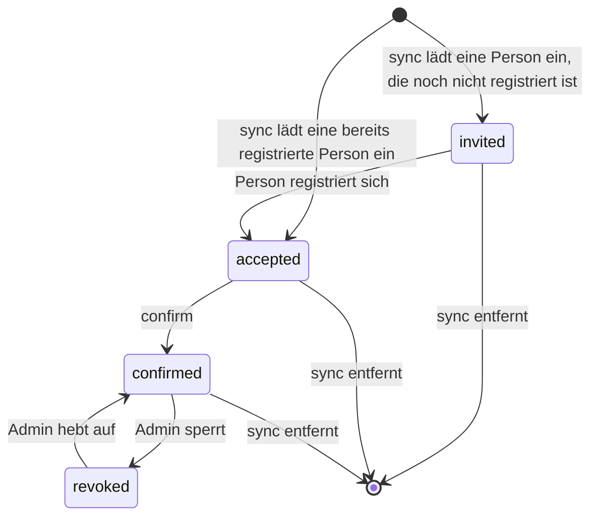
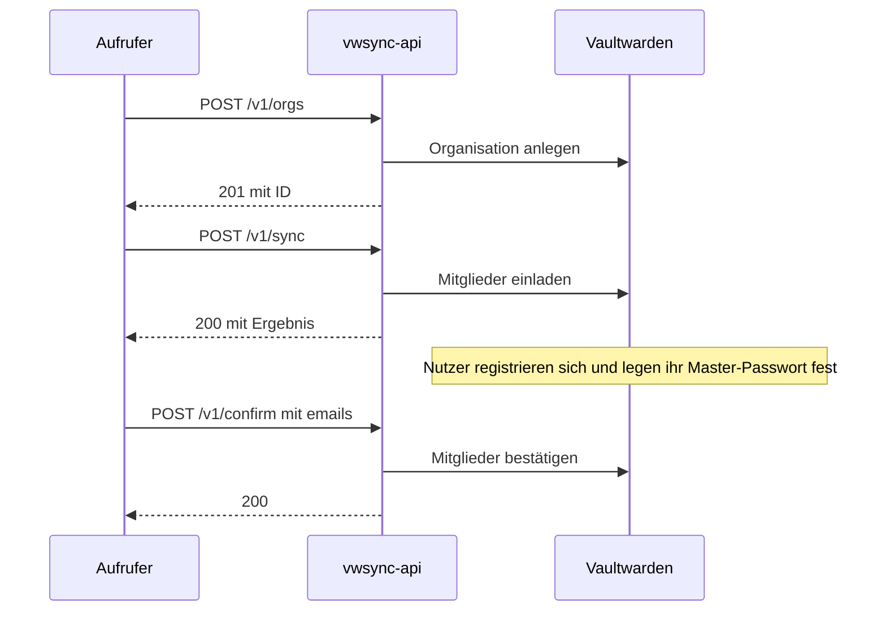

# API-Referenz

Diese Referenz beschreibt alle Endpunkte von vwsync-api. Eine Einführung steht in der [README](../README.md), die Installation in [SETUP.md](../SETUP.md).

## Inhalt

- [Konventionen](#konventionen)
- [Endpunkte im Überblick](#endpunkte-im-überblick)
- [Authentifizierung](#authentifizierung)
- [Organisationen](#organisationen): [`GET /v1/orgs`](#get-v1orgs), [`POST /v1/orgs`](#post-v1orgs)
- [Mitglieder](#mitglieder): [`GET /v1/orgs/{org}/members`](#get-v1orgsorgmembers), [`GET /v1/export`](#get-v1export)
- [Abgleich](#post-v1sync): [`POST /v1/sync`](#post-v1sync)
- [Bestätigung](#post-v1confirm): [`POST /v1/confirm`](#post-v1confirm)
- [Datentypen](#datentypen)
- [Rollen und Status](#rollen-und-status)
- [Typische Abläufe](#typische-abläufe)
- [Statuscodes](#statuscodes)

## Konventionen

Die Beispiele verwenden diese Variablen.

```bash
BASE=https://vwsync.example.com
KEY=vwsk_...    # Zugangsschlüssel, siehe Authentifizierung
```

**Format.** Alle Endpunkte unter `/v1` erwarten und liefern JSON. Der Body wird immer als JSON gelesen, ein `Content-Type`-Header ist nicht nötig. Unbekannte Felder im Body führen zu `400`.

**Authentifizierung.** Mit Ausnahme von `GET /healthz` verlangt jeder Endpunkt den Header `Authorization: Bearer <Zugangsschlüssel>`, siehe [Authentifizierung](#authentifizierung).

**Fehlerformat.** Jeder Fehler hat denselben Aufbau. Antworten enthalten weder Schlüssel noch Passwörter noch Request-Bodies.

```json
{ "error": "organization \"Nope\" not found, or the API account is neither owner nor admin there" }
```

**Ausführen und Vorschau.** Die schreibenden Endpunkte `POST /v1/orgs`, `POST /v1/sync` und `POST /v1/confirm` führen aus, was sie erhalten. Mit der Query `dry_run=true` ändern sie nichts und liefern eine Vorschau im selben Aufbau wie die Antwort eines echten Laufs. Das Feld `dry_run` in der Antwort benennt den Modus. Eine Vorschau vor dem ersten Aufruf mit einer neuen Soll-Datei ist empfehlenswert, denn ein echter Aufruf lässt sich nicht zurücknehmen.

Der Parameter `apply` wird nicht unterstützt. Wer ihn sendet, erhält `400`, damit `apply=false` nicht versehentlich als Ausführung endet.

**Organisationen ansprechen.** Eine Organisation lässt sich über ihre ID oder ihren Namen ansprechen. Die ID muss exakt stimmen. Beim Namen spielt die Groß- und Kleinschreibung keine Rolle, `team alpha` findet also "Team Alpha". Unterscheiden sich zwei Organisationen nur in der Schreibweise ihres Namens, gewinnt eine exakt passende Schreibweise. Passt keine exakt, antwortet der Dienst mit `422` und nennt die IDs. In Pfaden müssen Leerzeichen kodiert werden, etwa `Team%20Alpha`.

**E-Mail-Adressen.** Eingaben werden getrimmt und in Kleinbuchstaben umgewandelt. Antworten enthalten Adressen immer in Kleinbuchstaben.

**Ein Schreiblauf zugleich.** Die ausführenden Aufrufe von `/v1/orgs`, `/v1/sync` und `/v1/confirm` teilen sich eine Sperre. Läuft bereits einer, antwortet der Dienst sofort mit `409` und wartet nicht. Vorschauen und lesende Endpunkte sind nie gesperrt.

**Abbruch durch den Aufrufer.** Trennt der Aufrufer während eines ausführenden Aufrufs die Verbindung, läuft der Lauf zu Ende. Er ist auf höchstens zehn Minuten begrenzt.

**Wiederholbarkeit.** Der Abgleich ist idempotent. Nach einem erfolgreichen Lauf liefert derselbe Aufruf einen leeren Plan. Ein Lauf, der teilweise fehlgeschlagen ist, lässt sich ohne Nebenwirkungen wiederholen und holt nur den Rest nach.

## Endpunkte im Überblick

| Methode | Pfad | Authentifizierung | Zweck |
|---|---|---|---|
| `GET` | `/healthz` | nein | Lebenszeichen des Prozesses |
| `GET` | `/readyz` | nein | Bereitschaft: Vaultwarden erreichbar, Dienst fährt nicht herunter |
| `GET` | `/v1/orgs` | ja | Verwaltbare Organisationen auflisten |
| `POST` | `/v1/orgs` | ja | Organisation anlegen |
| `GET` | `/v1/orgs/{org}/members` | ja | Mitglieder einer Organisation |
| `GET` | `/v1/export` | ja | Ist-Zustand aller Organisationen |
| `POST` | `/v1/sync` | ja | Soll-Zustand herstellen |
| `POST` | `/v1/confirm` | ja | Wartende Mitglieder bestätigen |

---

## Authentifizierung

Der Dienst kennt keine Benutzer und keinen Login. Ein Aufrufer besitzt einen festen Zugangsschlüssel und sendet ihn mit jedem Request.

```bash
curl -H "Authorization: Bearer $KEY" $BASE/v1/orgs
```

**Der Schlüssel.** Er beginnt mit `vwsk_` und enthält 256 Bit Zufall. Der Betreiber erzeugt ihn mit `vwsync-api generate-key`. Der Befehl gibt den Schlüssel und die Konfigurationszeile `VWSYNC_API_KEY_HASH=...` aus. Der Dienst speichert nur den SHA-256-Hash des Schlüssels und vergleicht in konstanter Zeit. Den Schlüssel selbst kennt nur der Aufrufer. Er lässt sich nicht erneut anzeigen.

**Gültigkeit.** Der Schlüssel läuft nicht ab. Er gilt, solange sein Hash in `VWSYNC_API_KEY_HASH` steht. Die Variable darf mehrere Hashes durch Kommas getrennt enthalten. So bleibt beim Austausch eines Schlüssels der alte gültig, bis der Aufrufer auf den neuen umgestellt ist.

**Regeln für den Aufrufer.**

- Das Schema ist `Bearer`, ohne Beachtung der Groß- und Kleinschreibung. Andere Schemata wie `Basic` werden abgewiesen.
- Der Schlüssel gehört nur in den Header, nie in die URL. Parameter wie `?key=` ignoriert der Dienst, ein solcher Aufruf bleibt ohne Schlüssel und scheitert.
- Der Schlüssel gehört in eine Datei mit Rechten `0600` oder in einen Secret-Store, nicht in ein Repository, eine Crontab oder ein Log.

**Abgewiesene Aufrufe.** Fehlt der Schlüssel oder ist er falsch, antwortet der Dienst mit `401` und dem Header `WWW-Authenticate: Bearer`. Die Antwort unterscheidet nicht, ob der Schlüssel fehlte oder falsch war. Im Log des Dienstes steht die Zeile `request rejected` mit der Adresse des Aufrufers, aber nie der Schlüssel. Die Anfragen je Adresse begrenzt nginx.

### `GET /healthz`

Meldet, dass der Prozess antwortet. Der Endpunkt prüft nicht die Verbindung zu Vaultwarden und braucht keinen Schlüssel.

```bash
curl $BASE/healthz
```

```json
{ "status": "ok" }
```

### `GET /readyz`

Meldet, ob der Dienst gerade arbeiten kann. Dazu prüft er, ob Vaultwarden antwortet, und ob er selbst nicht gerade herunterfährt. Für Überwachung und Load-Balancer ist dieser Endpunkt die richtige Wahl. Er braucht keinen Schlüssel.

```bash
curl $BASE/readyz
```

| Code | Antwort | Bedeutung |
|---|---|---|
| `200` | `{"status":"ready"}` | Bereit |
| `503` | `{"status":"vaultwarden unreachable"}` | Vaultwarden antwortet nicht innerhalb von 5 Sekunden. Der Grund steht im Log des Dienstes, nicht in der Antwort |
| `503` | `{"status":"stopping"}` | Der Dienst fährt herunter und lässt nur noch laufende Requests zu Ende laufen |

---

## Organisationen

### `GET /v1/orgs`

Listet die Organisationen, die das API-Konto verwalten darf. Das sind Organisationen, in denen es bestätigter Owner oder Admin ist und die aktiv sind.

```bash
curl -H "Authorization: Bearer $KEY" $BASE/v1/orgs
```

```json
{
  "orgs": [
    { "id": "a73f7d38-1214-471f-8c8c-078db8723e2c", "name": "Team Alpha" }
  ]
}
```

Verwaltet das Konto keine Organisation, ist `orgs` die leere Liste `[]`.

### `POST /v1/orgs`

Legt eine Organisation an. Das API-Konto wird ihr Owner. Der Dienst erzeugt Organisations-Schlüssel und Schlüsselpaar selbst und überträgt sie verschlüsselt. Dafür braucht er das Master-Passwort des API-Kontos. Die neue Organisation ist sofort für `/v1/sync` und `/v1/confirm` nutzbar.

**Query**

| Parameter | Standard | Beschreibung |
|---|---|---|
| `dry_run` | `false` | `true` legt nichts an und prüft nur den Namen |

**Body**

| Feld | Typ | Pflicht | Beschreibung |
|---|---|---|---|
| `name` | string | ja | 1 bis 50 Zeichen nach dem Trimmen |
| `billing_email` | string | nein | Rechnungsadresse. Standard ist die Adresse des API-Kontos |

```bash
curl -X POST "$BASE/v1/orgs" -H "Authorization: Bearer $KEY" \
  -d '{"name":"Team Alpha"}'
```

**Antwort `200` (`dry_run=true`)**

```json
{ "dry_run": true, "org": { "name": "Team Alpha" } }
```

**Antwort `201` (angelegt)**

```json
{ "dry_run": false, "org": { "id": "a73f7d38-1214-471f-8c8c-078db8723e2c", "name": "Team Alpha" } }
```

**Hinweise**

- Vaultwarden erzwingt keine eindeutigen Organisationsnamen. Der Dienst prüft deshalb vor dem Anlegen, ob das API-Konto bereits eine Organisation mit diesem Namen verwaltet. Dabei zählt die Groß- und Kleinschreibung nicht. Die Prüfung läuft auch bei `dry_run=true`. Sie sieht nur Organisationen, die das Konto verwaltet.
- Die erste Sammlung der Organisation heißt "Default collection".
- Der Dienst bietet keinen Endpunkt zum Löschen von Organisationen.

**Fehler**

| Code | Ursache |
|---|---|
| `400` | Ungültiges JSON oder unbekanntes Feld |
| `409` | Eine Organisation mit diesem Namen existiert bereits, oder ein anderer Schreiblauf läuft |
| `422` | Name leer oder länger als 50 Zeichen, oder `billing_email` ungültig |
| `502` | Vaultwarden lehnt das Anlegen ab, etwa durch eine Serverkonfiguration oder eine Organisationsrichtlinie. Die Meldung von Vaultwarden steht in `error` |
| `503` | Das Master-Passwort ist nicht konfiguriert, und der Aufruf soll anlegen |

---

## Mitglieder

### `GET /v1/orgs/{org}/members`

Liefert alle Mitglieder einer Organisation mit Rolle und Status. `{org}` ist die ID oder der Name der Organisation.

```bash
curl -H "Authorization: Bearer $KEY" "$BASE/v1/orgs/Team%20Alpha/members"
```

```json
{
  "id": "a73f7d38-1214-471f-8c8c-078db8723e2c",
  "name": "Team Alpha",
  "members": [
    { "id": "5b1c0e7a-...", "email": "alice@example.com", "role": "owner",  "status": "confirmed" },
    { "id": "9d42f3c1-...", "email": "bob@example.com",   "role": "custom", "status": "accepted" }
  ]
}
```

`id` eines Mitglieds ist die Mitgliedschafts-ID von Vaultwarden. Alle Endpunkte des Dienstes arbeiten mit E-Mail-Adressen, die ID wird von Aufrufern normalerweise nicht gebraucht.

**Fehler**

| Code | Ursache |
|---|---|
| `404` | Die Organisation existiert nicht, oder das API-Konto ist dort weder Owner noch Admin |
| `422` | Der Name ist mehrdeutig, siehe [Konventionen](#konventionen) |

### `GET /v1/export`

Liefert den Ist-Zustand aller verwaltbaren Organisationen. Die Antwort enthält zusätzlich `desired` im Format des Bodys von `/v1/sync`. Der Block dient als Vorlage, um den Zustand zu sichern oder zu bearbeiten und anschließend zurückzuschicken.

```bash
curl -H "Authorization: Bearer $KEY" $BASE/v1/export
```

```json
{
  "orgs": [
    {
      "id": "a73f7d38-...",
      "name": "Team Alpha",
      "members": [
        { "id": "5b1c0e7a-...", "email": "alice@example.com", "role": "owner", "status": "confirmed" }
      ]
    }
  ],
  "desired": {
    "orgs": { "Team Alpha": { "members": { "alice@example.com": "owner" } } }
  }
}
```

Schickt der Aufrufer `desired` unverändert an `/v1/sync`, ändert sich nichts. Gesperrte Mitglieder fehlen in `desired`, der Abgleich lässt sie aber unangetastet.

---

## `POST /v1/sync`

Stellt den Soll-Zustand her. Der Dienst lädt fehlende Personen ein, gleicht abweichende Rollen an und entfernt Mitglieder, die nicht im Soll stehen.

**Query**

| Parameter | Standard | Beschreibung |
|---|---|---|
| `dry_run` | `false` | `true` führt nichts aus, die Antwort enthält nur den Plan |
| `no_remove` | `false` | `true` entfernt niemanden |
| `max_removals` | `5` | Obergrenze für Entfernungen. Sind über alle Organisationen mehr geplant, antwortet der Dienst mit `422` und ändert nichts |

**Body**

```json
{
  "orgs": {
    "Team Alpha": {
      "members": {
        "alice@example.com": "admin",
        "bob@example.com": "custom"
      }
    },
    "a73f7d38-1214-471f-8c8c-078db8723e2c": { "members": {} }
  }
}
```

| Feld | Beschreibung |
|---|---|
| `orgs` | Objekt mit einer Organisation je Schlüssel. Der Schlüssel ist Name oder ID |
| `orgs.<org>.members` | Objekt mit E-Mail-Adresse als Schlüssel und Rolle als Wert |

Gültige Rollen sind `owner`, `admin`, `manager`, `custom` und `user`, siehe [Rollen und Status](#rollen-und-status).

**Verhalten**

- Organisationen, die nicht im Body stehen, bleiben unberührt.
- Eine Organisation mit leerer Mitgliederliste (`"members": {}`) bedeutet, dass alle Mitglieder außer dem API-Konto entfernt werden sollen. Die Obergrenze `max_removals` schützt vor einem versehentlich leeren Soll.
- Das API-Konto wird nie geändert oder entfernt, unabhängig davon, ob es im Body steht.
- Gesperrte Mitglieder (`revoked`) bleiben unangetastet. Der Dienst hebt die Sperre nicht auf und entfernt sie nicht, auch wenn sie nicht im Soll stehen. Sie erscheinen in `warnings`.
- Eingeladene und registrierte Mitglieder gelten als Mitglieder. Stehen sie nicht im Soll, werden sie entfernt.
- Eine Person, die noch kein Konto hat, lädt der Dienst trotzdem ein. Vaultwarden legt dafür eine Einladung an, mit der sie sich registrieren kann. Das setzt voraus, dass Vaultwarden Einladungen erlaubt (`INVITATIONS_ALLOWED`, standardmäßig aktiv) und, falls eine Domain-Liste gesetzt ist, die Adresse dazu passt. Sonst schlägt die Änderung mit der Meldung von Vaultwarden fehl.
- Bei einem Rollenwechsel bleiben bestehende Zuordnungen zu Sammlungen erhalten.
- Eine fehlgeschlagene Änderung stoppt die übrigen nicht.

```bash
# Vorschau
curl -X POST "$BASE/v1/sync?dry_run=true" -H "Authorization: Bearer $KEY" -d @soll.json

# Ausführen
curl -X POST $BASE/v1/sync -H "Authorization: Bearer $KEY" -d @soll.json
```

**Antwort `200` oder `207`**

```json
{
  "dry_run": false,
  "failures": 1,
  "plans": [
    {
      "org": { "id": "a73f7d38-...", "name": "Team Alpha" },
      "changes": [
        { "type": "invite", "email": "carol@example.com", "role": "user" },
        { "type": "role",   "email": "bob@example.com",   "role": "custom", "from": "user" },
        { "type": "remove", "email": "dave@example.com" }
      ],
      "warnings": [
        "erin@example.com is revoked in \"Team Alpha\" and was skipped"
      ],
      "results": [
        { "type": "invite", "email": "carol@example.com", "role": "user", "ok": true },
        { "type": "role",   "email": "bob@example.com",   "role": "custom", "from": "user", "ok": true },
        { "type": "remove", "email": "dave@example.com", "ok": false, "error": "DELETE /api/organizations/... -> 404: ..." }
      ]
    }
  ]
}
```

| Feld | Beschreibung |
|---|---|
| `dry_run` | `true`, wenn der Aufruf mit `dry_run=true` nur eine Vorschau lieferte |
| `failures` | Anzahl der fehlgeschlagenen Änderungen. Bei `0` antwortet der Dienst mit `200`, sonst mit `207` |
| `plans` | Eintrag je Organisation, nach Organisationsschlüssel sortiert |
| `plans[].changes` | Geplante Änderungen, nach E-Mail sortiert. Zuerst kommen Einladungen und Rollenwechsel, danach Entfernungen |
| `plans[].warnings` | Hinweise, etwa übersprungene gesperrte Mitglieder |
| `plans[].results` | Nur bei einem ausführenden Aufruf. Ein Eintrag je Änderung mit `ok` und gegebenenfalls `error` |

`changes[].type` ist `invite`, `role` oder `remove`. `role` nennt die Zielrolle, `from` bei einem Rollenwechsel die bisherige Rolle.

**Fehler**

| Code | Ursache |
|---|---|
| `207` | Der Lauf wurde ausgeführt, mindestens eine Änderung ist fehlgeschlagen |
| `400` | Ungültiges JSON, unbekanntes Feld, unbekannte Rolle oder ungültiger Query-Wert |
| `404` | Eine Organisation aus dem Body existiert nicht, oder das API-Konto ist dort weder Owner noch Admin. Es wird nichts geändert |
| `409` | Ein anderer Schreiblauf läuft |
| `422` | Ungültige oder doppelte E-Mail-Adresse, mehrdeutiger Organisationsname oder Überschreitung von `max_removals` |
| `502` | Vaultwarden ist nicht erreichbar oder lehnt die Abfrage ab |

---

## `POST /v1/confirm`

Bestätigt Mitglieder, die sich in Vaultwarden registriert haben und den Status `accepted` tragen. Erst nach der Bestätigung haben sie Zugriff auf die Daten der Organisation. Der Dienst entschlüsselt den Organisations-Schlüssel und verschlüsselt ihn für jedes Mitglied neu. Dafür braucht er das Master-Passwort des API-Kontos.

Wer sich noch nicht registriert hat, kann nicht bestätigt werden, weil für ihn noch kein öffentlicher Schlüssel existiert. Der Dienst lässt ihn unverändert und meldet ihn in `waiting`. Sobald sich die Person registriert, wechselt ihr Status von selbst auf `accepted`, und der nächste Aufruf bestätigt sie. Aufrufer können `confirm` deshalb regelmäßig mit derselben Adressliste senden.

Der Dienst durchsucht alle Organisationen, die das API-Konto verwaltet.

**Query**

| Parameter | Standard | Beschreibung |
|---|---|---|
| `dry_run` | `false` | `true` bestätigt niemanden und listet nur. Die Vorschau braucht kein Master-Passwort |
| `all` | `false` | `true` bestätigt alle wartenden Mitglieder |

**Body (optional)**

```json
{ "emails": ["alice@example.com", "bob@example.com"] }
```

**Auswahl der Mitglieder.** Beim Bestätigen vertraut der Dienst dem öffentlichen Schlüssel, den Vaultwarden für das Mitglied liefert. Wer den Server kontrolliert, könnte dort einen fremden Schlüssel hinterlegen. Deshalb muss jeder Aufruf entweder `emails` nennen oder ausdrücklich `all=true` setzen. Beides zugleich oder keins von beiden ergibt `400`. Die Liste `emails` begrenzt die Bestätigung auf Adressen, die der Aufrufer selbst eingeladen hat.

```bash
# Vorschau
curl -X POST "$BASE/v1/confirm?dry_run=true" -H "Authorization: Bearer $KEY" \
  -d '{"emails":["alice@example.com"]}'

# Bestätigen
curl -X POST $BASE/v1/confirm -H "Authorization: Bearer $KEY" \
  -d '{"emails":["alice@example.com"]}'
```

**Antwort `200` oder `207`**

```json
{
  "dry_run": false,
  "failures": 0,
  "orgs": [
    {
      "org": { "id": "a73f7d38-...", "name": "Team Alpha" },
      "pending": ["alice@example.com"],
      "waiting": ["carol@example.com"],
      "results": [ { "email": "alice@example.com", "ok": true } ]
    }
  ]
}
```

| Feld | Beschreibung |
|---|---|
| `orgs` | Nur Organisationen mit bestätigbaren oder wartenden Mitgliedern. Gibt es keine, ist die Liste leer |
| `orgs[].pending` | Adressen der registrierten Mitglieder (`accepted`), die jetzt bestätigt werden können |
| `orgs[].waiting` | Adressen aus der Auswahl, die als Mitglied eingeladen, aber noch nicht registriert sind (`invited`). Bei `all=true` sind es alle solchen Mitglieder. Ein Tippfehler in `emails` erscheint hier nicht, denn nur tatsächliche Mitglieder werden gemeldet |
| `orgs[].results` | Nur bei einem ausführenden Aufruf. Ein Eintrag je Mitglied mit `ok` und gegebenenfalls `error` |

Beim ersten Bestätigen entsperrt der Dienst den Schlüssel des API-Kontos. Das dauert einen Moment. Der Schlüssel bleibt danach im Speicher des Prozesses. Gibt es nichts zu bestätigen, bleibt der Schlüssel gesperrt und der Aufruf braucht kein Master-Passwort.

**Fehler**

| Code | Ursache |
|---|---|
| `207` | Mindestens eine Bestätigung ist fehlgeschlagen |
| `400` | Weder `emails` noch `all=true` angegeben, oder beides |
| `409` | Ein anderer Schreiblauf läuft |
| `500` | Das Master-Passwort ist falsch. Die Meldung lautet `unlocking user key: MAC mismatch (wrong master password?)` |
| `503` | Das Master-Passwort ist nicht konfiguriert, und es gibt Mitglieder zu bestätigen |

---

## Datentypen

**Organisation**

| Feld | Typ | Beschreibung |
|---|---|---|
| `id` | string | ID der Organisation |
| `name` | string | Name der Organisation |

**Mitglied**

| Feld | Typ | Beschreibung |
|---|---|---|
| `id` | string | Mitgliedschafts-ID von Vaultwarden |
| `email` | string | Adresse in Kleinbuchstaben |
| `role` | string | `owner`, `admin`, `manager`, `custom`, `user` oder `unknown` |
| `status` | string | `invited`, `accepted`, `confirmed` oder `revoked` |

**Änderung**

| Feld | Typ | Beschreibung |
|---|---|---|
| `type` | string | `invite`, `role` oder `remove` |
| `email` | string | Betroffene Adresse |
| `role` | string | Zielrolle bei `invite` und `role` |
| `from` | string | Bisherige Rolle bei `role` |

## Rollen und Status

### Rollen

| Rolle | Bedeutung |
|---|---|
| `owner` | Besitzer der Organisation |
| `admin` | Administrator |
| `custom` | Benutzerdefinierte Rolle mit der Berechtigung "Alle Sammlungen verwalten". Sie darf Sammlungen anlegen, bearbeiten und löschen und hat keine weiteren Rechte |
| `manager` | Manager ohne diese Berechtigung |
| `user` | Normales Mitglied |
| `unknown` | Ein Rollentyp, den der Dienst nicht kennt. Er erscheint nur in Antworten und lässt sich nicht setzen |

Vaultwarden meldet `manager` und `custom` beide mit dem Typ 4 und unterscheidet sie über die drei Sammlungs-Berechtigungen "anlegen", "bearbeiten" und "löschen". Der Dienst wertet genau diese aus.

Die Rollen `owner`, `admin`, `manager` und `custom` kann in Vaultwarden nur ein Owner der Organisation vergeben. Ist das API-Konto nur Admin, schlägt die jeweilige Änderung mit einer Meldung von Vaultwarden fehl. Ob ein `manager` ohne die Berechtigung "Alle Sammlungen verwalten" trotzdem Sammlungen anlegen darf, hängt von der Vaultwarden-Version ab. Wer das ausschließen will, vergibt `user` oder `custom`.

### Status



| Status | Bedeutung |
|---|---|
| `invited` | Eingeladen, aber noch nicht registriert. Die Person hat noch kein Master-Passwort |
| `accepted` | Registriert, wartet auf `confirm` und hat noch keinen Zugriff auf die Daten |
| `confirmed` | Vollwertiges Mitglied |
| `revoked` | Gesperrt. Der Dienst lässt solche Mitglieder unverändert |

Der Dienst ist für Vaultwarden ohne Mailversand ausgelegt. Niemand muss eine Einladung annehmen. Der Status hängt davon ab, ob sich die Person schon registriert hat.

- **Bereits registriert.** Die Einladung setzt den Status sofort auf `accepted`.
- **Noch nicht registriert.** Der Status bleibt `invited`. Registriert sich die Person später mit derselben Adresse, wechselt er von selbst auf `accepted`. Das gilt auch, wenn die allgemeine Registrierung in Vaultwarden abgeschaltet ist, denn die Einladung gestattet sie für diese Adresse. Die Person muss die Adresse und den Server selbst kennen, der Dienst benachrichtigt sie nicht.

## Typische Abläufe

### Neue Organisation mit Mitgliedern



### Regelmäßiger Abgleich

Ein Skript auf dem Server des Aufrufers kann den Abgleich zyklisch ausführen. Der Dienst hält keinen Zustand, die Soll-Datei liegt beim Aufrufer. Weil `confirm` nur registrierte Personen bestätigt und die übrigen als wartend meldet, bestätigt derselbe Lauf neue Mitglieder automatisch, sobald sie sich registriert haben.

```bash
#!/bin/sh
set -eu
BASE=https://vwsync.example.com
H="Authorization: Bearer $(cat /etc/vwsync/key)"

curl -sf -X POST "$BASE/v1/sync" -H "$H" -d @/etc/vwsync/soll.json
EMAILS=$(jq -c '[.orgs[].members | keys[]] | unique | {emails: .}' /etc/vwsync/soll.json)
curl -sf -X POST "$BASE/v1/confirm" -H "$H" -d "$EMAILS"
```

Der Schlüssel gehört in eine Datei mit Rechten `0600` oder in einen Secret-Store, nicht in die Crontab. Die Option `-f` von curl lässt das Skript bei `4xx` und `5xx` scheitern. Die Antwort `207` zählt für curl als Erfolg. Ein produktives Skript prüft deshalb zusätzlich das Feld `failures` im Body.

## Statuscodes

| Code | Bedeutung |
|---|---|
| `200` | Erfolgreich, auch bei einer Vorschau mit `dry_run=true` |
| `201` | Organisation angelegt |
| `207` | Der Lauf wurde ausgeführt, mindestens eine Änderung ist fehlgeschlagen. `failures` und `results[].error` nennen sie. Die übrigen Änderungen sind ausgeführt |
| `400` | Ungültiger Body oder ungültige Query. Dazu zählen unbekannte JSON-Felder und der nicht unterstützte Parameter `apply` |
| `401` | Der Zugangsschlüssel fehlt oder ist falsch |
| `404` | Organisation nicht gefunden, oder das API-Konto ist dort weder Owner noch Admin |
| `409` | Ein anderer Schreiblauf läuft, oder die Organisation existiert bereits |
| `422` | Inhaltlich ungültig, etwa E-Mail-Adresse, Organisationsname, mehrdeutiger Name oder `max_removals` |
| `500` | Interner Fehler oder falsches Master-Passwort. Die Meldung steht in `error`, Details stehen im Log |
| `502` | Vaultwarden hat den Aufruf abgelehnt oder ist nicht erreichbar |
| `503` | Das Master-Passwort ist nicht konfiguriert, obwohl die Aktion es braucht |
