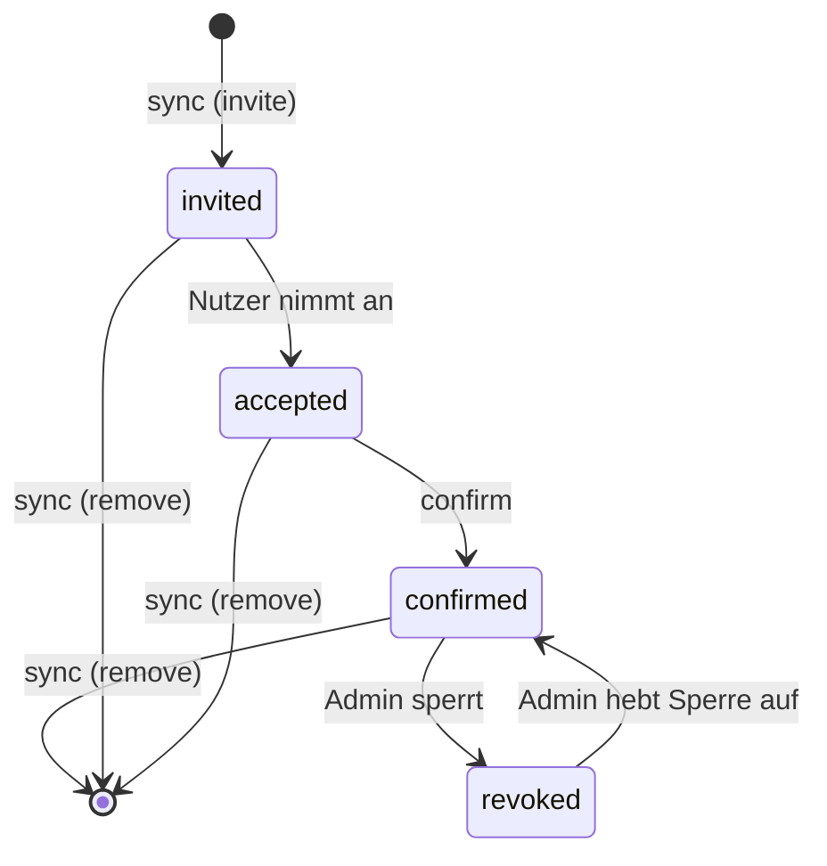
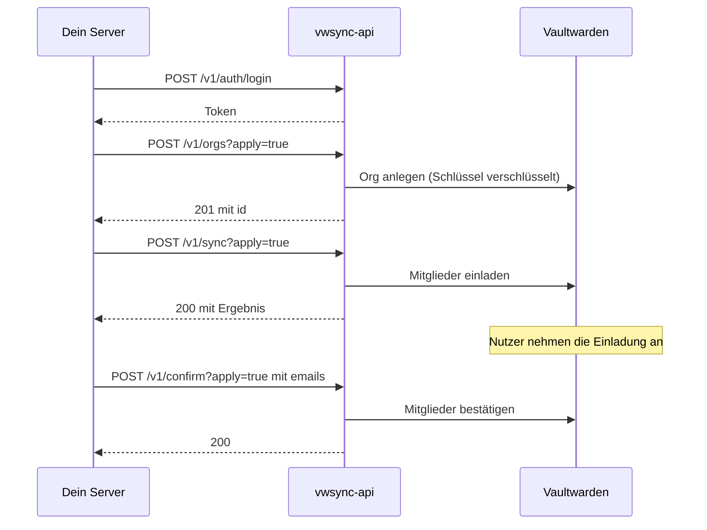

# API-Referenz

Basis-URL: `https://vwsync.example.com`. Alle Endpunkte unter `/v1` sprechen JSON, Requests mit Body brauchen keinen besonderen `Content-Type`-Header, der Body wird immer als JSON gelesen.

Die Beispiele nutzen diese Variablen:

```bash
BASE=https://vwsync.example.com
TOKEN=...   # siehe "Login" unten
```

## Inhalt

- [Grundlagen](#grundlagen)
- [Login](#post-v1authlogin)
- [Organisationen](#organisationen): [auflisten](#get-v1orgs), [anlegen](#post-v1orgs)
- [Mitglieder](#mitglieder): [je Org](#get-v1orgsorgmembers), [Export](#get-v1export)
- [Sync](#post-v1sync)
- [Confirm](#post-v1confirm)
- [Rollen und Status](#rollen-und-status)
- [Typische Abläufe](#typische-abläufe)
- [Statuscodes](#statuscodes)

## Grundlagen

**Authentifizierung.** Außer `GET /healthz` und `POST /v1/auth/login` verlangt jeder Endpunkt den Header `Authorization: Bearer <token>`. Das Token kommt vom Login und gilt standardmäßig 15 Minuten (`VWSYNC_TOKEN_TTL`).

**Logs.** Jeder Request erscheint im Log mit Methode, Pfad, Query und Status. Jede ausgeführte Änderung steht zusätzlich als eigene Zeile `audit` im Log, mit Org, Art, E-Mail und Ergebnis. Ein Dry-Run erzeugt keine `audit`-Zeilen.

**Fehlerformat.** Jeder Fehler hat denselben Aufbau und enthält nie Passwörter, Tokens oder Request-Bodies:

```json
{ "error": "organization \"Nope\" not found, or the API account is neither owner nor admin there" }
```

**Dry-Run ist Standard.** Alle schreibenden Endpunkte (`POST /v1/orgs`, `/v1/sync`, `/v1/confirm`) ändern erst etwas, wenn die Query `apply=true` gesetzt ist. Ohne sie zeigt die Antwort, was passieren würde.

**Org ansprechen.** Eine Organisation lässt sich über Name oder ID ansprechen. Die ID muss exakt stimmen, beim Namen zählt die Groß- und Kleinschreibung nicht: `team alpha` findet "Team Alpha". Gibt es zwei Orgs, deren Namen sich nur darin unterscheiden, gewinnt die exakte Schreibweise. Passt keine exakt, antwortet der Service mit `422` und nennt die IDs. Namen mit Leerzeichen müssen in Pfaden URL-kodiert werden (`Team%20Alpha`).

**E-Mail-Adressen** sind in Antworten immer klein geschrieben, Eingaben werden klein geschrieben und getrimmt.

**Ein Schreiblauf zugleich.** `apply=true` bei `/v1/orgs`, `/v1/sync` und `/v1/confirm` nimmt eine gemeinsame Sperre. Läuft schon ein Schreibzugriff, antwortet der zweite sofort mit `409`, er wartet nicht. Dry-Runs und Lese-Endpunkte sind nie gesperrt.

**Abbruch des Clients.** Trennt der Aufrufer bei einem `apply=true`-Request die Verbindung, läuft der Lauf trotzdem zu Ende (bis zu 10 Minuten).

---

## `GET /healthz`

Lebenszeichen ohne Login. Prüft nur, ob der Prozess antwortet, nicht die Verbindung zu Vaultwarden.

```bash
curl $BASE/healthz
```

```json
{ "status": "ok" }
```

---

## `POST /v1/auth/login`

Tauscht Benutzername und Passwort gegen ein Token.

**Body**

| Feld | Typ | Pflicht |
|---|---|---|
| `username` | string | ja |
| `password` | string | ja |

```bash
TOKEN=$(curl -s -X POST $BASE/v1/auth/login \
  -d '{"username":"sync","password":"..."}' | jq -r .access_token)
```

**Antwort `200`**

```json
{ "access_token": "eyJhbGciOi...", "token_type": "Bearer", "expires_in": 899 }
```

`expires_in` sind Sekunden bis zum Ablauf. Danach antwortet jeder Endpunkt mit `401`, und der Aufrufer meldet sich neu an.

**Fehler**

| Code | Wann |
|---|---|
| `401` | Benutzername oder Passwort falsch. Die Meldung unterscheidet die beiden nicht |
| `429` | 5 fehlgeschlagene Logins innerhalb einer Minute von derselben Adresse. Der Header `Retry-After` nennt die Wartezeit in Sekunden. Auch das richtige Passwort wird in dieser Zeit abgewiesen |

---

## Organisationen

### `GET /v1/orgs`

Alle Organisationen, die das API-Konto verwalten darf: bestätigter Owner oder Admin, Org aktiv.

```bash
curl -H "Authorization: Bearer $TOKEN" $BASE/v1/orgs
```

```json
{ "orgs": [ { "id": "a73f7d38-1214-471f-8c8c-078db8723e2c", "name": "Team Alpha" } ] }
```

Ohne verwaltbare Orgs ist `orgs` eine leere Liste `[]`.

### `POST /v1/orgs`

Legt eine Organisation an. Das API-Konto wird Owner und kann die Org danach sofort mit `/v1/sync` und `/v1/confirm` nutzen. Braucht `VW_MASTER_PASSWORD`, weil der Service den Organisations-Key und das Schlüsselpaar selbst erzeugt und verschlüsselt an Vaultwarden schickt.

**Query**

| Parameter | Standard | Bedeutung |
|---|---|---|
| `apply` | `false` | `true` legt die Org wirklich an |

**Body**

| Feld | Typ | Pflicht | Bedeutung |
|---|---|---|---|
| `name` | string | ja | 1 bis 50 Zeichen, nach dem Trimmen |
| `billing_email` | string | nein | Standard: die Adresse des API-Kontos |

Unbekannte Felder werden mit `400` abgelehnt.

```bash
curl -X POST "$BASE/v1/orgs?apply=true" -H "Authorization: Bearer $TOKEN" \
  -d '{"name":"Team Alpha"}'
```

**Antwort Dry-Run `200`**

```json
{ "dry_run": true, "org": { "name": "Team Alpha" } }
```

**Antwort `201`**

```json
{ "dry_run": false, "org": { "id": "a73f7d38-1214-471f-8c8c-078db8723e2c", "name": "Team Alpha" } }
```

**Verhalten**

- Namen sind bei Vaultwarden nicht eindeutig. Der Service prüft deshalb vorher ohne Beachtung der Groß- und Kleinschreibung, ob das API-Konto schon eine gleichnamige Org verwaltet, und antwortet mit `409`. Das gilt auch im Dry-Run. Die Prüfung sieht nur Orgs, die das API-Konto verwaltet.
- Die erste Collection heißt "Default collection".
- Es gibt keinen Endpunkt zum Löschen von Organisationen.

**Fehler**

| Code | Wann |
|---|---|
| `409` | Org mit diesem Namen existiert schon, oder ein anderer Schreiblauf läuft |
| `422` | Name leer oder länger als 50 Zeichen, oder `billing_email` ungültig |
| `502` | Vaultwarden lehnt ab, zum Beispiel wegen `ORG_CREATION_USERS` oder einer Single-Org-Policy. Die Meldung von Vaultwarden steht in `error` |
| `503` | `apply=true`, aber `VW_MASTER_PASSWORD` ist nicht gesetzt |

---

## Mitglieder

### `GET /v1/orgs/{org}/members`

Alle Mitglieder einer Organisation mit Rolle und Status. `{org}` ist Name oder ID.

```bash
curl -H "Authorization: Bearer $TOKEN" "$BASE/v1/orgs/Team%20Alpha/members"
```

```json
{
  "id": "a73f7d38-1214-471f-8c8c-078db8723e2c",
  "name": "Team Alpha",
  "members": [
    { "id": "5b1c...", "email": "alice@example.com", "role": "owner", "status": "confirmed" },
    { "id": "9d42...", "email": "bob@example.com", "role": "custom", "status": "accepted" }
  ]
}
```

`id` im Mitglied ist die Mitgliedschafts-ID von Vaultwarden. Wer sie nicht braucht, kann sie ignorieren, alle Endpunkte arbeiten mit E-Mail-Adressen.

Fehler: `404`, wenn die Org nicht existiert oder das API-Konto dort weder Owner noch Admin ist.

### `GET /v1/export`

Der Ist-Zustand aller verwaltbaren Orgs. Zusätzlich liefert die Antwort `desired` im Format des Sync-Bodys, gesperrte Mitglieder ausgenommen. Das ist die Vorlage, um den Zustand zu sichern oder zu editieren und an `/v1/sync` zurückzuschicken.

```bash
curl -H "Authorization: Bearer $TOKEN" $BASE/v1/export
```

```json
{
  "orgs": [
    { "id": "a73f...", "name": "Team Alpha", "members": [ { "id": "5b1c...", "email": "alice@example.com", "role": "owner", "status": "confirmed" } ] }
  ],
  "desired": {
    "orgs": { "Team Alpha": { "members": { "alice@example.com": "owner" } } }
  }
}
```

Der `desired`-Teil ist garantiert ein Nichts-zu-tun-Plan: Schickst du ihn unverändert an `/v1/sync`, ändert sich nichts. Das gilt auch für gesperrte Mitglieder: Sie fehlen im `desired`, werden aber von `/v1/sync` nicht entfernt.

---

## `POST /v1/sync`

Stellt den Soll-Zustand her: Fehlende Personen einladen, abweichende Rollen angleichen, nicht gewünschte Mitglieder entfernen.

**Query**

| Parameter | Standard | Bedeutung |
|---|---|---|
| `apply` | `false` | `true` führt die Änderungen aus, sonst nur Plan |
| `no_remove` | `false` | `true` entfernt nie jemanden |
| `max_removals` | `5` | Löschbremse. Sind über alle Orgs mehr Entfernungen geplant, antwortet der Service mit `422` und ändert nichts |

**Body**

```json
{
  "orgs": {
    "Team Alpha": { "members": { "alice@example.com": "admin", "bob@example.com": "custom" } },
    "a73f7d38-1214-471f-8c8c-078db8723e2c": { "members": {} }
  }
}
```

- Der Org-Schlüssel ist Name oder ID.
- Rollen: `owner`, `admin`, `manager`, `custom`, `user` ([Details](#rollen-und-status)).
- Orgs, die nicht im Body stehen, werden nicht angefasst.
- Eine Org mit leerer Mitgliederliste (`"members": {}`) bedeutet: alle entfernen außer dem API-Konto. Die Löschbremse fängt das ab.
- Unbekannte JSON-Felder werden mit `400` abgelehnt, damit ein Tippfehler wie `"membres"` nicht still "alle entfernen" bedeutet.

**Verhalten**

- Das **API-Konto selbst** wird nie geändert oder entfernt, auch wenn es im Body steht oder fehlt.
- **Gesperrte** Mitglieder (`revoked`) fasst der Service nie an: Er hebt die Sperre nicht auf und **entfernt sie auch nicht**, selbst wenn sie nicht im Soll stehen oder die Org leer sein soll. Sie erscheinen als Warnung in `warnings`. Entfernen kann sie nur ein Admin in Vaultwarden.
- Bei **Rollenwechseln** bleiben bestehende Collection-Zuordnungen erhalten.
- **Eingeladene und angenommene** Mitglieder zählen als Mitglieder: Stehen sie nicht im Soll, werden sie entfernt.
- Das Planen ist **idempotent**: Nach einem erfolgreichen Lauf ist der nächste Plan leer.
- Eine **fehlgeschlagene Änderung** stoppt die übrigen nicht. Wiederholen holt den Rest nach.

```bash
# Erst ansehen ...
curl -X POST $BASE/v1/sync -H "Authorization: Bearer $TOKEN" -d @soll.json
# ... dann ausführen
curl -X POST "$BASE/v1/sync?apply=true" -H "Authorization: Bearer $TOKEN" -d @soll.json
```

**Antwort `200`** (oder `207`, siehe unten)

```json
{
  "dry_run": false,
  "failures": 0,
  "plans": [
    {
      "org": { "id": "a73f...", "name": "Team Alpha" },
      "changes": [
        { "type": "invite", "email": "carol@example.com", "role": "user" },
        { "type": "role",   "email": "bob@example.com",   "role": "custom", "from": "user" },
        { "type": "remove", "email": "dave@example.com" }
      ],
      "warnings": [ "erin@example.com is revoked in \"Team Alpha\" and was skipped" ],
      "results": [
        { "type": "invite", "email": "carol@example.com", "role": "user", "ok": true },
        { "type": "role",   "email": "bob@example.com",   "role": "custom", "from": "user", "ok": true },
        { "type": "remove", "email": "dave@example.com", "ok": false, "error": "DELETE /api/organizations/... -> 404: ..." }
      ]
    }
  ]
}
```

| Feld | Bedeutung |
|---|---|
| `dry_run` | `true`, wenn `apply` nicht gesetzt war |
| `failures` | Anzahl fehlgeschlagener Änderungen |
| `plans[].changes` | Was getan werden muss. Reihenfolge stabil: sortiert nach E-Mail, erst Einladen und Rollen, dann Entfernen |
| `changes[].type` | `invite`, `role` oder `remove` |
| `plans[].results` | Nur mit `apply=true`. Eine Zeile je Änderung mit `ok` und gegebenenfalls `error` |
| `plans[].warnings` | Hinweise, zum Beispiel übersprungene gesperrte Mitglieder |

**Fehler**

| Code | Wann |
|---|---|
| `207` | Lauf durchgeführt, aber `failures` > 0 |
| `400` | Ungültiges JSON, unbekanntes Feld, unbekannte Rolle, ungültiger Query-Wert |
| `404` | Eine Org aus dem Body gibt es nicht, oder das API-Konto ist dort weder Owner noch Admin. Es wird nichts geändert |
| `409` | Ein anderer Schreiblauf läuft |
| `422` | Ungültige oder doppelte E-Mail-Adresse, ein mehrdeutiger Org-Name, oder die Löschbremse hat ausgelöst |
| `502` | Vaultwarden war nicht erreichbar oder hat die Planung abgelehnt |

---

## `POST /v1/confirm`

Bestätigt Mitglieder, die ihre Einladung angenommen haben (Status `accepted`). Erst danach haben sie Zugriff auf die Daten der Org. Der Service entschlüsselt den Organisations-Key und verschlüsselt ihn für jedes Mitglied neu. Das braucht `VW_MASTER_PASSWORD`.

Der Service sucht in **allen** Orgs, die das API-Konto verwaltet.

**Query**

| Parameter | Standard | Bedeutung |
|---|---|---|
| `apply` | `false` | `true` bestätigt wirklich. Der Dry-Run braucht kein Master-Passwort |
| `all` | `false` | `true` bestätigt jeden wartenden Nutzer |

**Body** (optional)

```json
{ "emails": ["alice@example.com", "bob@example.com"] }
```

**Allowlist-Pflicht.** Beim Bestätigen vertraut der Service dem Public Key, den Vaultwarden für das Mitglied liefert. Wer den Server kontrolliert, könnte dort einen eigenen Schlüssel unterschieben. Deshalb muss jeder Aufruf entweder `emails` nennen oder ausdrücklich `all=true` setzen. Beides zugleich oder keins von beiden ergibt `400`. Wer nur Adressen bestätigen will, die er selbst eingeladen hat, nimmt `emails`.

```bash
# Wer würde bestätigt?
curl -X POST $BASE/v1/confirm -H "Authorization: Bearer $TOKEN" \
  -d '{"emails":["alice@example.com"]}'

# Bestätigen
curl -X POST "$BASE/v1/confirm?apply=true" -H "Authorization: Bearer $TOKEN" \
  -d '{"emails":["alice@example.com"]}'
```

**Antwort `200`** (oder `207`)

```json
{
  "dry_run": false,
  "failures": 0,
  "orgs": [
    {
      "org": { "id": "a73f...", "name": "Team Alpha" },
      "pending": ["alice@example.com"],
      "results": [ { "email": "alice@example.com", "ok": true } ]
    }
  ]
}
```

- `orgs` enthält nur Orgs mit wartenden Mitgliedern. Ist niemand zu bestätigen, ist die Liste leer.
- `pending` listet die Kandidaten, `results` gibt es nur mit `apply=true`.
- Der Entsperrvorgang (PBKDF2 mit vielen Runden, oder Argon2id) läuft beim ersten Bestätigen und dauert kurz. Danach bleibt der Schlüssel im Speicher des Prozesses.

**Fehler**

| Code | Wann |
|---|---|
| `207` | Mindestens eine Bestätigung ist fehlgeschlagen |
| `400` | Weder `emails` noch `all=true`, oder beides |
| `409` | Ein anderer Schreiblauf läuft |
| `500` | `unlocking user key: MAC mismatch (wrong master password?)`: `VW_MASTER_PASSWORD` stimmt nicht |
| `503` | `apply=true`, aber `VW_MASTER_PASSWORD` ist nicht gesetzt |

---

## Rollen und Status

**Rollen**

| Rolle | Bedeutung |
|---|---|
| `owner` | Besitzer der Org |
| `admin` | Administrator |
| `custom` | Custom-Rolle mit "Alle Sammlungen verwalten": Sammlungen anlegen, bearbeiten und löschen. Sonst keine Rechte |
| `manager` | Manager ohne diese Berechtigung |
| `user` | normales Mitglied |

Vaultwarden meldet `manager` und `custom` beide als Typ 4. Der Service unterscheidet sie über die drei Sammlungs-Berechtigungen. Wer `owner`, `admin`, `manager` oder `custom` vergeben will, muss selbst Owner der Org sein, das erlaubt Vaultwarden nicht anders.

`manager` darf auf Vaultwarden 1.35 noch Sammlungen anlegen, ab 1.37 nicht mehr. Wenn die Sperre wichtig ist, nimm `user` oder `custom`.

In Antworten kann außerdem `unknown` stehen: ein Typ, den der Service nicht kennt. Er lässt sich nicht setzen.

**Status**



| Status | Bedeutung |
|---|---|
| `invited` | Eingeladen, noch nicht angenommen |
| `accepted` | Angenommen, wartet auf `confirm`. Ohne Zugriff auf die Daten |
| `confirmed` | Volles Mitglied |
| `revoked` | Gesperrt. `sync` lässt sie unverändert und meldet eine Warnung |

Ist bei Vaultwarden keine Mail konfiguriert, wird ein bereits registrierter Nutzer sofort `accepted`. Neue Nutzer müssen sich zuerst registrieren.

---

## Typische Abläufe

**Neue Org mit Mitgliedern**



**Laufender Abgleich per Cron**

Auf deinem Server, alle 15 Minuten. Die Soll-Datei liegt dort, der Service hält keinen Zustand.

```bash
#!/bin/sh
set -eu
BASE=https://vwsync.example.com
TOKEN=$(curl -sf -X POST "$BASE/v1/auth/login" \
  -d "{\"username\":\"sync\",\"password\":\"$VWSYNC_PASSWORD\"}" | jq -r .access_token)
H="Authorization: Bearer $TOKEN"

curl -sf -X POST "$BASE/v1/sync?apply=true" -H "$H" -d @/etc/vwsync/soll.json
EMAILS=$(jq -c '[.orgs[].members | keys[]] | unique | {emails: .}' /etc/vwsync/soll.json)
curl -sf -X POST "$BASE/v1/confirm?apply=true" -H "$H" -d "$EMAILS"
```

Das Passwort gehört in eine Datei mit Rechten `0600` oder den Secret-Store, nicht in die Crontab. Bei jedem `207` oder Fehlercode sollte das Skript alarmieren. `curl -f` lässt es bei 4xx und 5xx fehlschlagen, `207` zählt als Erfolg und muss über `failures` im Body geprüft werden.

---

## Statuscodes

| Code | Bedeutung |
|---|---|
| `200` | Erfolgreich, auch ein Dry-Run |
| `201` | Org angelegt |
| `207` | Lauf durchgeführt, aber mindestens eine Änderung ist fehlgeschlagen. `failures` und `results[].error` nennen sie. Die übrigen Änderungen wurden ausgeführt |
| `400` | Ungültiger Body oder Query. Unbekannte JSON-Felder zählen dazu |
| `401` | Kein oder ungültiges oder abgelaufenes Token, oder falsche Zugangsdaten |
| `404` | Org nicht gefunden, oder das API-Konto ist dort weder Owner noch Admin |
| `409` | Ein anderer Schreiblauf läuft, oder die Org existiert schon |
| `422` | Inhaltlich ungültig: E-Mail, Orgname, mehrdeutiger Orgname, Löschbremse |
| `429` | Zu viele fehlgeschlagene Logins. `Retry-After` beachten |
| `500` | Interner Fehler oder falsches Master-Passwort. Die Meldung steht in `error`, Details im Log |
| `502` | Vaultwarden hat den Aufruf abgelehnt oder war nicht erreichbar |
| `503` | `VW_MASTER_PASSWORD` fehlt für eine Aktion, die es braucht |
